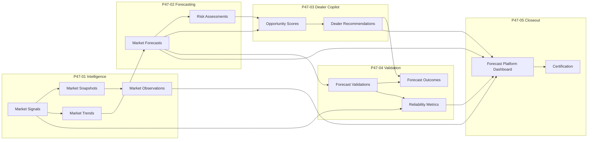

# Forecast Platform Architecture

ComicOS forecast and decision-intelligence stack delivered across P47-01 through P47-05.

## P47-01 — Market Intelligence Foundation and Agents

- **Models** — `MarketSignal`, `MarketSnapshot`, `MarketTrend`, `MarketObservation`, `MarketAgentExecution`
- **Agents** — signal collection, snapshot generation, trend calculation, observation generation
- **Constraint** — append-only intelligence records, no forecasting or recommendations yet

## P47-02 — Forecasting and Trend Agents

- **Models** — `MarketForecast`, `MarketForecastPoint`, `MarketForecastConfidence`, `MarketRiskAssessment`, `ForecastAgentExecution`
- **Agents** — price forecast, trend forecast, market risk
- **Constraint** — append-only forecast history, no dealer decisions

## P47-03 — Dealer Copilot and Opportunity Agents

- **Models** — `DealerRecommendation`, evidence, review, opportunity score, execution
- **Agents** — buy list, sell, hold, grade candidate, watchlist
- **Engine** — deterministic ranking and evidence-backed recommendation generation
- **Constraint** — advisory only, no automatic market actions

## P47-04 — Forecast Validation, Learning, and Reliability Agents

- **Models** — `ForecastValidation`, `ForecastAccuracyMetric`, `ForecastDriftEvent`, `SignalQualityMetric`, `ForecastOutcome`, `ForecastValidationExecution`
- **Agents** — forecast validation, learning, reliability
- **Constraint** — observation only, no retraining or model mutation

## P47-05 — Forecast Platform Closeout

- **Validation** — `forecast_platform_validation` verifies market intelligence, forecasts, risks, dealer copilot, and validation/learning
- **Health** — `forecast_platform_health` computes on-demand health for all decision-intelligence layers
- **Summary** — `forecast_platform_summary` aggregates market score, forecasts, risks, recommendations, and accuracy
- **API** — `/api/v1/forecast-platform/*`
- **UI** — `/forecast-platform` (`ForecastPlatformPage`)
- **Docs** — runbook, architecture, and deferred tech debt captured for platform certification

## Integration boundaries

## Certification principles

- Everything in P47 is append-only.
- Forecasts and recommendations are never mutated by closeout services.
- Validation and health are calculated on demand.
- Certification is deterministic and owner scoped.
- P47 closeout does not introduce live-use guardrails; that is deferred to P48.
