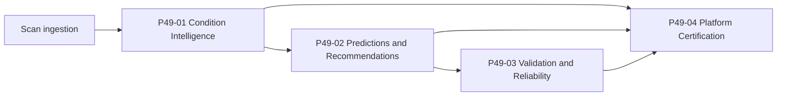

# Grading Platform Architecture (P49)

The P49 Grading Intelligence Platform stacks scan-derived condition intelligence, advisory grade predictions, and observational validation. It sits beside (and does not replace) the P37 deterministic grading economics and submission workflow.

## P49-01 — Scan Analysis & Condition Intelligence

- **Purpose:** Scan quality, defects, condition profiles, and subgrades from ingested images.
- **Key models:** `scan_analysis`, `condition_profile`, `condition_defect`, `condition_subgrade`, `scan_quality_assessment`, `condition_agent_execution`.
- **API prefix:** `/api/v1/condition-intelligence`
- **Constraints:** No grade prediction in this phase; owner-scoped analyses.

## P49-02 — Grade Prediction & Grading Agents

- **Purpose:** PSA-style advisory predictions, recommendations, ROI, and submission priority ranking.
- **Key models:** `grade_prediction`, `grade_prediction_evidence`, `grading_intelligence_recommendation`, `grading_intelligence_roi_analysis`, `grading_intelligence_agent_execution`.
- **API prefix:** `/api/v1/grading-intelligence`
- **Constraints:** No inventory or submission mutation; distinct table names from P37 grading entities.

## P49-03 — Grading Calibration, Validation & Reliability

- **Purpose:** Measure prediction accuracy, calibration, drift, reliability, and recommendation outcomes.
- **Key models:** `grade_validation`, `grade_calibration_metric`, `grade_prediction_outcome`, `grading_drift_event`, `grading_reliability_metric`, `grading_validation_execution`.
- **API prefix:** `/api/v1/grading-validation`
- **Constraints:** Observational only—no prediction or recommendation updates, no retraining.

## P49-04 — Grading Platform Closeout & Certification

- **Purpose:** Read-only validation, health, summary, and personal production certification across P49-01–03.
- **Services:** `grading_platform_validation`, `grading_platform_health`, `grading_platform_summary`
- **API prefix:** `/api/v1/grading-platform`
- **UI:** `/grading-platform`
- **Constraints:** No new grading models or prediction logic; deterministic PASS/WARNING/FAIL checks.

## Data flow (high level)

## Integration boundaries

- **P37:** Spread, ROI, submission batch, and reconciliation engines remain the operational grading economics layer.
- **P47/P48:** Forecast and production readiness certification are independent; grading platform certification is scoped to P49 only.
