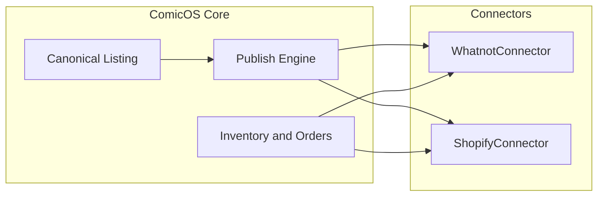

# Marketplace Platform Architecture

ComicOS marketplace stack delivered in P46 (connector framework through production closeout).

## P46-01 — Connector Framework

- **Models** — `MarketplaceDefinition`, `MarketplaceAccount`, `MarketplaceCredential`, `MarketplaceCapability`, `MarketplaceExecution`.
- **Base** — `MarketplaceConnectorBase` defines connect/disconnect/validate/capabilities; executions via `marketplace_execution`.
- **Registry & seed** — `marketplace_registry`, `marketplace_seed` for marketplace codes and capabilities.

## P46-02 — Catalog & Listing Model

- **Canonical listing** — `MarketplaceListing` and related variant, image, price, status history, mapping tables.
- **Services** — `marketplace_listings`, mappings, images, prices; owner-scoped CRUD and readiness transitions.

## P46-03 — Publish Engine

- **Jobs** — `MarketplacePublishJob`, targets, events, validation issues.
- **Flow** — validate → plan → ready → connector execution → complete; `marketplace_publish_engine`, planner, validation.

## P46-04 — Inventory & Order Sync

- **Safety layer** — Reservations, availability, sync plans, orders, items, events, allocation.
- **Principle** — Connectors sync from computed availability; no ad-hoc inventory mutation outside approved services.

## P46-05 — Operations Agents

- Advisory agents (listing quality, inventory health, pricing, unsold inventory, audit) over marketplace data.
- Recommendations and evidence; no autonomous marketplace writes.

## P46-06 — Whatnot Integration

- **Connector** — `whatnot_connector` (stub transport).
- **Services** — accounts, listing publish, inventory sync, order import.
- **API** — `/api/v1/whatnot/*`; pause/resume listing support.

## P46-07 — Shopify Integration

- **Connector** — `shopify_connector` (stub transport).
- **Services** — accounts, product publish, inventory sync, order import.
- **API** — `/api/v1/shopify/*`; archive/restore product support.

## P46-08 — Platform Closeout

- **Validation** — `marketplace_validation` (read-only PASS/WARNING/FAIL checks).
- **Health** — `marketplace_health` (on-demand HEALTHY/WARNING/FAILED/DISABLED).
- **Analytics** — `marketplace_analytics` (owner-scoped aggregates; distinct from P43 org marketplace analytics).
- **Dashboard API** — `/api/v1/marketplace-dashboard/*`.
- **UI** — `/marketplace-dashboard` (MarketplaceDashboardPage).

## Integration boundaries

## Related systems (out of P46 scope)

- **P43** — Organization-scoped marketplace ops and analytics dashboards (separate routes and models).
- **P47+** — Forecasting and buy-list intelligence build on inventory and market data, not new connector surfaces in P46.
