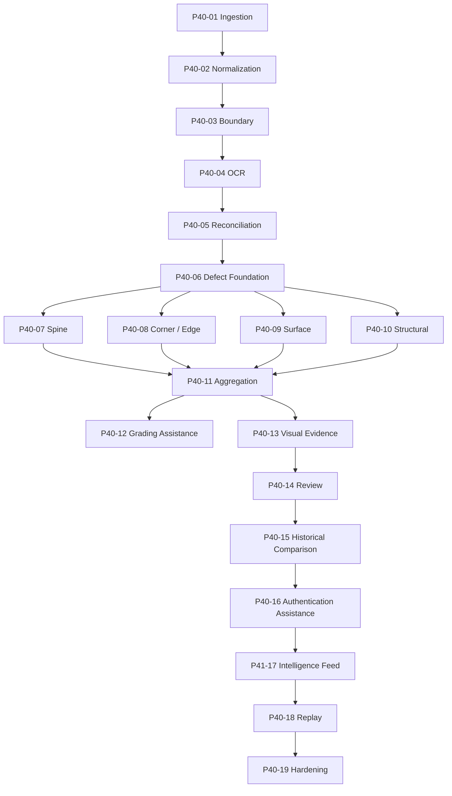

# P40 Dependency Graph

This document summarizes the dependency and lineage relationships across the completed P40 stack.

## High-level flow

## Upstream / downstream rules

- Ingestion is the root lineage source for all later phases.
- Normalization, boundary, OCR, and reconciliation are required prerequisites for most downstream evidence phases.
- Defect foundation fans out into the specialized detector lanes.
- Aggregation depends on the detector outputs that exist for a given scan image.
- Feed and replay are cross-phase systems that read the completed ledgers and never mutate them.
- Hardening reads the entire stack and validates the contracts without adding behavior.

## Optional phases

- Visual evidence, review, historical comparison, authentication assistance, and feed may all be present or absent depending on the scan image and workflow.
- Missing optional phases are surfaced explicitly in feed/replay/hardening outputs; they are not silently inferred.

## Checksum lineage chains

- Original scan checksum originates at ingestion.
- Each downstream phase carries forward its own phase checksum and source checksum references.
- Feed computes a stable `feed_checksum` from the ordered scan timeline.
- Replay computes a stable `replay_checksum` from the ordered verification manifest.
- Hardening validates those checksums without changing them.

## Artifact lineage chains

- Phase artifacts are append-only and remain rooted to their originating run ids and scan image ids.
- Feed artifacts summarize the system timeline and reference the selected upstream context.
- Replay artifacts summarize verification evidence and reference the replay run.
- Hardening artifacts are documentation-only and do not introduce new runtime ledgers.

## Review / authentication dependencies

- Review consumes visual evidence and scan context.
- Historical comparison consumes review history and prior scan context.
- Authentication assistance consumes review, visual evidence, historical comparison, and scan lineage.
- The feed layer aggregates the resulting evidence and the replay layer audits the complete chain.

## Deterministic ordering guarantees

- Ordering is stable by phase rank, event rank, timeline rank, and replay step rank.
- When a phase is missing, the omission is recorded explicitly instead of reordering or fabricating the ledger.
- Stable ordering is preserved in lists, manifests, artifacts, and ops rollups.

