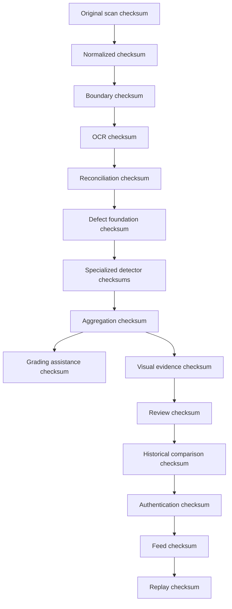

# P40 Scan Lifecycle

This document describes the full lifecycle of a scan through the completed P40 stack.

## Lifecycle stages

1. Ingestion
2. Normalization
3. Boundary mapping
4. OCR
5. Reconciliation
6. Defect foundation
7. Specialized defect systems
8. Aggregation
9. Grading assistance
10. Visual evidence
11. Review
12. Historical comparison
13. Authentication assistance
14. Intelligence feed
15. Replay verification

## Lifecycle narrative

### Ingestion
The scan enters the system as an immutable original. The ingestion checksum is the root of the later lineage chain.

### Normalization through reconciliation
The image is normalized, bounded, OCRed, and reconciled into canonical reference data. Each step produces its own artifact and history trail.

### Defect foundation and specialized detectors
The defect foundation establishes condition evidence. The specialized detector lanes refine the evidence into spine, corner / edge, surface, and structural ledgers.

### Aggregation and grading assistance
Detector outputs are aggregated into higher-order condition evidence. Grading assistance remains support-only and does not assign an official grade.

### Visual evidence and review
Visual evidence packages the immutable outputs into reviewable artifacts. Review records human decisions and notes over that immutable evidence.

### Historical comparison and authentication assistance
Historical comparison compares current scan lineage to prior scans. Authentication assistance records identity-support signals and consistency checks without certifying authenticity.

### Intelligence feed
The feed layer assembles the completed ledger into a deterministic timeline with stable ordering, append-only artifacts, and replay-safe manifest hashing.

### Replay verification
Replay audits the completed P40 lineage chain, checksum continuity, artifact integrity, ordering stability, and immutability contracts.

## Lineage flow

## Artifact propagation

- Each phase writes its own immutable artifacts and history rows.
- Downstream phases may reference upstream artifact ids and checksums.
- Feed and replay both emit their own append-only artifacts instead of rewriting upstream ones.

## Review flow

- Review consumes immutable evidence.
- Review decisions and notes become append-only history.
- Review does not mutate upstream artifacts or retroactively change lineage.

## Replay flow

- Replay reads the full chain of stored outputs.
- Replay validates checksum continuity, ordering stability, and immutability.
- Replay discrepancies are preserved for audit review.

