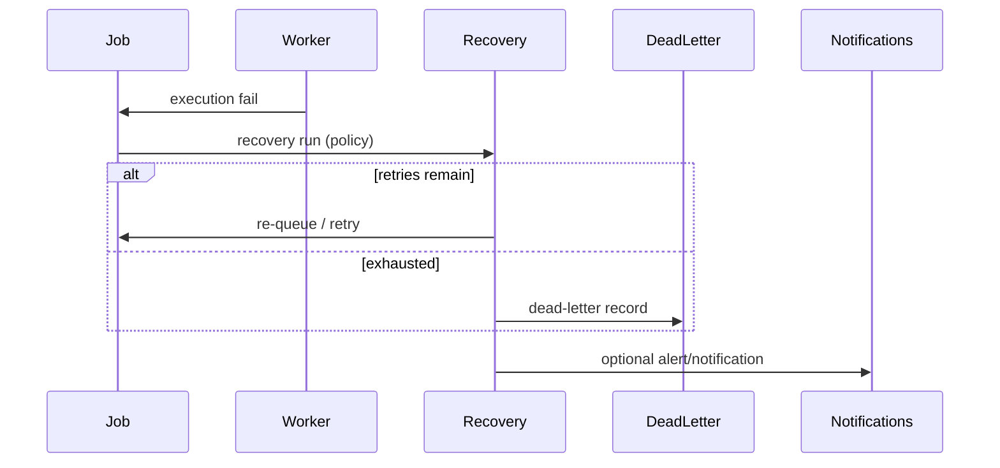

# P41 Automation Lifecycle

## Scope

This document describes the nominal deterministic lifecycle from job creation through recovery, messaging, ops visibility, rules evaluation, and integrity verification. It is descriptive of implemented P41 behavior, not a roadmap for new features.

## Lifecycle stages

### 1. Job created

- A job is inserted on an `AutomationQueue` with `job_key`, `deterministic_rank`, `payload_snapshot_json`, and checksums.
- Optional dependencies link to other jobs.
- History event appended (`CREATED` or equivalent).

### 2. Job becomes available

- `job_status` transitions to a queue-visible state (`QUEUED`, etc.) with `available_at` respected.
- Queue selection orders by deterministic rank (and configured queue ordering rules).

### 3. Worker reserves job

- Worker registers (ops) and sends heartbeats.
- Lease acquisition binds `worker_id` + `job_id` with `reservation_token` and expiry.
- Expired leases can be released via ops maintenance endpoints.

### 4. Worker starts execution

- Execution row created with `execution_rank`, `execution_status`, snapshot JSON, and `execution_checksum`.
- Job `started_at` / status updated in a lineage-safe manner.

### 5. Workflow triggers downstream jobs

- Schedules/triggers (ops processing or configured activation) start workflow executions.
- Workflow steps enqueue downstream jobs with stable step rank ordering.
- Workflow history records execution transitions append-only.

### 6. Failures enter recovery

- Failed executions or job failures emit failure events.
- Recovery runs created under retry policy with manifest checksums.
- Job attempt history preserved.

### 7. Retries / dead-letter

- Deterministic backoff and attempt limits per policy.
- When exhausted, job moves to dead-letter ledger (no silent removal).
- Ops visibility via recovery and jobs ops routes.

### 8. Notifications / alerts

- Operational events may create notifications with delivery rows per channel/rank.
- Alerts escalate from notifications when configured.
- Delivery failures surface in ops notification diagnostics.

### 9. Ops snapshots monitor state

- Ops administrator creates snapshot (aggregates queue depth, workers, workflows, failures, replay warnings, etc.).
- Metrics, audits, and optional safe controls recorded with manifest checksum.

### 10. Rules evaluate automation policy

- Ops creates rules and immutable versions.
- Evaluation matches restricted expressions against supplied input snapshots.
- Actions execute in deterministic rank order; forbidden destructive actions blocked.

### 11. Hardening verifies integrity

- Focused pytest suites validate ordering, checksum stability, isolation, and envelope shape.
- Scan replay (P40-18) remains the platform determinism verifier for scan pipelines; P41 layers integrate via replay warnings in ops/analytics visibility.

## State transition tables (summary)

### Job (representative)

| From | To | Typical trigger |
| --- | --- | --- |
| CREATED | QUEUED | Enqueue / availability |
| QUEUED | RESERVED | Worker lease |
| RESERVED | RUNNING | Execution start |
| RUNNING | COMPLETED | Execution complete |
| RUNNING | FAILED | Execution fail |
| FAILED | RETRY_SCHEDULED | Recovery policy |
| RETRY_SCHEDULED | QUEUED | Retry availability |
| FAILED | DEAD_LETTER | Retry exhaustion |

Exact status strings are defined in services; transitions always append history.

### Worker

| From | To | Typical trigger |
| --- | --- | --- |
| ACTIVE | STALE | Missed heartbeats (ops diagnostics) |
| ACTIVE | SHUTDOWN | Graceful shutdown record |

### Workflow execution

| From | To | Typical trigger |
| --- | --- | --- |
| CREATED | RUNNING | Ops/workflow execute |
| RUNNING | COMPLETED / FAILED | Step/job outcomes |

## Append-only events

Every layer maintains history tables (`automation_job_history`, worker history, workflow history, recovery history, batch history, notification history, ops history, rules history, analytics history). Updates to immutable snapshots (ops, analytics, rule versions) create **new rows**, not edits.

## Replay-safe checkpoints

Checkpoints suitable for replay verification:

- Job payload + job checksum at creation
- Execution checksum at start/complete
- Recovery manifest at recovery run creation
- Batch manifest at batch completion
- Notification + delivery checksum set at creation
- Ops/rules/analytics manifest at snapshot/evaluation creation

## Failure / recovery flow

## Notification flow

Notification created → deliveries ranked by channel → delivery status transitions → optional alert escalation → append-only notification history.

## Rules flow

Rule version active → evaluation with input JSON → expression match → ordered action plan → side effects within safe boundaries → evaluation artifacts + history.
