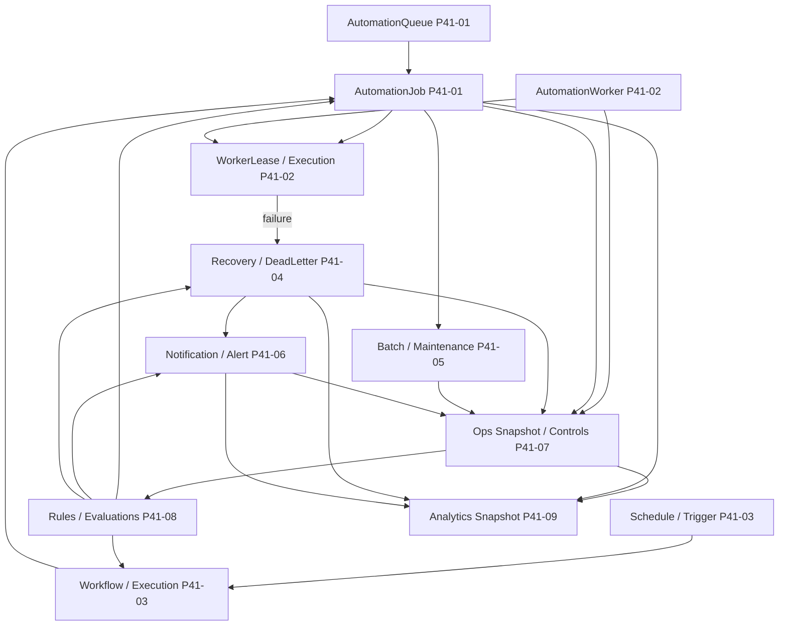

# P41 Automation Dependency Graph

## Purpose

This document maps how P41 subsystems depend on one another, how checksum lineage flows, and where owner isolation and safe admin boundaries apply.

## Structural dependency diagram

## Relationship reference

| From | To | Relationship |
| --- | --- | --- |
| Queue | Worker | Workers declare `queue_scope_json`; reservation selects jobs from scoped queues in deterministic order. |
| Queue | Workflow | Workflow steps enqueue jobs on queues; workflow execution manifests reference job lineage. |
| Workflow | Jobs | Executions materialize or reference downstream jobs with stable ranks and checksums. |
| Worker | Lease / execution | A lease binds worker + job; executions append runtime checksum lineage. |
| Failed job | Recovery | Failures create recovery runs and failure events under retry policy checksums. |
| Recovery | Dead-letter | Exhausted retries promote to dead-letter records (append-only, no silent delete). |
| Notification | Alert | Alerts may reference source notifications; escalation is ledger-backed. |
| Rules | Actions | Evaluations plan ordered actions (queue pause, workflow run, notification, recovery, etc.). |
| Ops dashboard | All automation | Snapshots aggregate counts/issues from queues, workers, workflows, recovery, batch, notifications, replay warnings. |
| Analytics | Ops + runtime | Analytics snapshots aggregate operational metrics; they do not mutate upstream ledgers. |

## Checksum lineage chains (canonical)

### Job execution chain

`payload_checksum` → `job_checksum` → attempt/execution snapshots → worker `execution_checksum` → job history `event_checksum` → optional job artifacts.

### Workflow chain

`workflow` metadata → execution `execution_checksum` → execution manifest → workflow history events.

### Recovery chain

`retry_policy.policy_checksum` → `recovery_checksum` → recovery manifest → dead-letter `dead_letter_checksum` when applicable.

### Batch chain

partition inputs → chunk `chunk_checksum` → batch `batch_checksum` → manifest → batch artifacts.

### Notification chain

`notification_checksum` → per-delivery `delivery_checksum` → alert `alert_checksum` → notification history.

### Ops chain

operational inputs → metric/audit/control checksums → manifest → `snapshot_checksum` → ops artifacts.

### Rules chain

`version_checksum` → evaluation input hash → `evaluation_checksum` → ordered `action_checksum` → manifest → artifacts.

### Analytics chain

operational metric drafts → metric/trend/comparison checksums → manifest → `snapshot_checksum` → analytics artifacts.

## Replay-safe lineage

- Idempotency keys: owner-scoped keys (`snapshot_key`, `batch_key`, `notification_key`, `rule_key` + replay keys, analytics `replay_key`, etc.) return existing rows on repeat POST with `200 OK`.
- History tables are append-only; status transitions add new history rows rather than rewriting prior payloads.
- Artifacts are written once per checksum/type path; repeated runs reuse stored bytes when paths match.

## Owner / org isolation

- Owner routes filter by authenticated `owner_user_id` (and organization when present on models).
- Ops routes require `ensure_ops_admin_access` via configured ops admin emails.
- Cross-owner reads return `404` on owner routes to avoid leaking existence.
- Dead-letter and global worker counts in ops/analytics may require joining through owner-scoped job IDs where applicable.

## Safe admin control boundaries

**Allowed (ops):** pause/resume queue, pause/resume workflow, acknowledge alert, create recovery/batch/notification, replay verify, maintenance-oriented controls documented in ops architecture.

**Rejected:** destructive controls such as delete queue, purge dead letter, force replay overwrite, and similar patterns blocked in ops and rules action planners.

Rules engine side effects remain **planned then applied** as minimal, auditable mutations compatible with the same boundaries.
