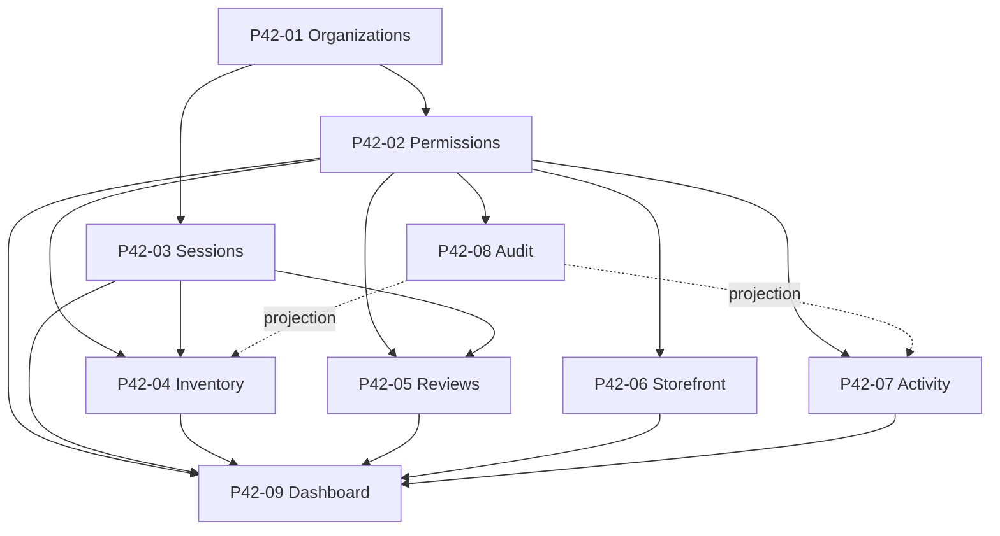

# P42 Dependency Graph

Deterministic dependency hierarchy for multi-user dealer infrastructure.

## Layer 0 — Platform prerequisites

- User accounts and authentication (pre-P42)
- Owner-scoped inventory copies (pre-P42)
- Scan API v1 envelope (`ScanApiV1Envelope`, pagination helpers)

## Layer 1 — Organization core (P42-01)

**Organizations** are the tenant root: `Organization`, `OrganizationMember`, `OrganizationInvitation`, `OrganizationEvent`.

- Upstream: none within P42
- Downstream: every other P42 subsystem

## Layer 2 — Authorization (P42-02)

**Permissions** attach to org membership via system roles and `OrganizationPermissionAudit`.

- Upstream: organizations, members
- Downstream: all org-scoped APIs and services

## Layer 3 — Security context (P42-03)

**Sessions** (`UserAuthSession`, `UserAuthSessionEvent`) carry optional `organization_id` for active org context.

- Upstream: organizations, members
- Downstream: org permission checks that validate session org binding

## Layer 4 — Operational domains (parallel, same dependency tier)

Each domain depends on Layers 1–3 only; domains do not own each other’s lineage tables.

| Domain | Primary persistence | Reads from |
|--------|---------------------|------------|
| Shared inventory (P42-04) | assignments, queues, workflow events | org, permissions, inventory copies |
| Reviews (P42-05) | reviews, decisions, review events | org, permissions, inventory copies |
| Storefronts (P42-06) | dealer profile, settings, storefront events | org, permissions, public visibility rules |
| Activity (P42-07) | activity events, notifications | org, membership |
| Audit (P42-08) | audit ledger, compliance, access logs | org, permissions (projections from other flows) |
| Dashboard (P42-09) | snapshots, metrics, dashboard events | org, permissions; **aggregates** inventory, reviews, storefront, activity, notifications, sessions |

## Upstream / downstream rules

- **Upstream** for dashboard: inventory, reviews, storefront visibility, activity counts, notifications, staff membership, org-bound sessions.
- **Downstream** from dashboard: none (read-only aggregation in P42).
- **Audit** ingests projections from workflows; workflow tables are not duplicated into audit storage beyond append-only entries.

## P43 integration points (contracts)

| P42 asset | P43 should |
|-----------|------------|
| `organization_id` | Scope all marketplace or external dealer features |
| Permission keys | Reuse `evaluate_permission`; add new keys only via role definitions |
| Storefront public slug | Attach listings without exposing internal inventory fields |
| Audit ledger | Emit new `audit_action` values; do not mutate historical rows |
| Dashboard metrics | Extend metric registry in a new phase; do not break snapshot ordering |
| Activity feed | Publish domain events as `activity_type` + category; avoid bypassing feed for user-visible history |

See [P42_FUTURE_INTEGRATION_MAP.md](./P42_FUTURE_INTEGRATION_MAP.md) for contract detail.
