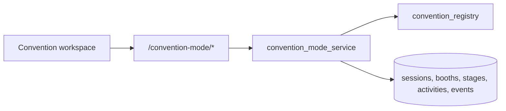

# P44-04 — Convention Mode Operations

P44-04 introduces organization-scoped convention-floor operations: sessions, booths, inventory staging, activity logs, and append-only convention events. It does not implement payments, quick-sale checkout, tax, receipts, or marketplace publishing.

## Architecture

## Session workflow

| Status | Meaning |
| --- | --- |
| `planned` | Created, not yet on the floor |
| `active` | Convention in progress (`started_at` set) |
| `completed` | Wrapped (`ended_at` set) |
| `archived` | Historical record |

PATCH session status drives deterministic transitions and lineage (`convention_session_started`, `convention_session_completed`).

## Booth workflow

Booths belong to a session. Statuses: `setup` → `active` / `paused` → `closed`. Opening/closing emits `booth_opened` / `booth_closed` events and matching activity rows.

## Inventory staging

`ConventionInventoryStage` tracks items on the floor (`staged`, `displayed`, `reserved`, `removed`). POST stages an item idempotently per session; removal updates status to `removed` and logs `inventory_removed` (service-level; no sales).

## Activity tracking

`ConventionActivity` stores operational signals (`session_created`, `inventory_staged`, `inventory_removed`, `booth_opened`, `booth_closed`) for floor dashboards.

## Replay-safe guarantees

- Lists ordered by `(created_at, id)` or `(staged_at, id)`
- `ConventionEvent` is append-only
- Org-scoped FKs, no destructive cascades
- Unauthorized access records `unauthorized_convention_access_attempt`

## Event types

- `convention_session_created`
- `convention_session_started`
- `convention_session_completed`
- `booth_created`
- `booth_opened`
- `booth_closed`
- `inventory_staged`
- `inventory_removed`
- `unauthorized_convention_access_attempt`

## Permissions

View: `organization:view`. Manage: `organization:update`.

## Future quick-sale dependencies

Quick-sale and mobile checkout can bind to active convention sessions, open booths, and staged inventory without changing this lineage model—transactions remain a later phase.

## API (v1 envelope)

| Method | Path |
| --- | --- |
| GET | `/organizations/{organization_id}/convention-mode` |
| GET/POST | `/organizations/{organization_id}/convention-mode/sessions` |
| PATCH | `/organizations/{organization_id}/convention-mode/sessions/{session_id}` |
| GET/POST | `/organizations/{organization_id}/convention-mode/booths` |
| PATCH | `/organizations/{organization_id}/convention-mode/booths/{booth_id}` |
| GET/POST | `/organizations/{organization_id}/convention-mode/inventory` |
| GET | `/organizations/{organization_id}/convention-mode/activities` |

Engine tag: `convention_mode` → `P44-04`.
