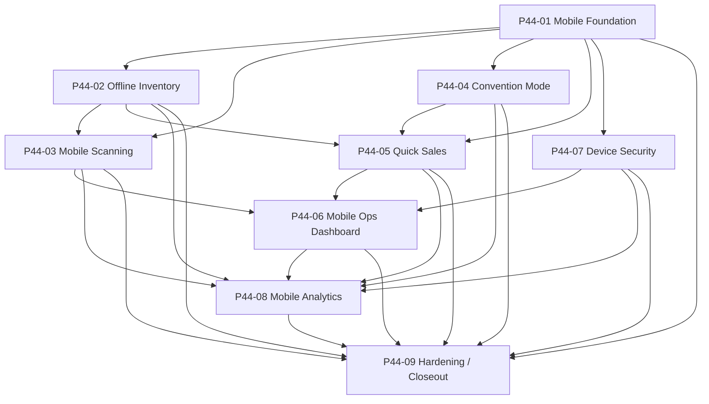

# P44 Dependency Graph

P44 is intentionally layered. Each later phase depends on stable contracts from earlier phases instead of bypassing them.

## Dependency Notes

- `P44-01` is the ownership and runtime anchor for devices, sessions, and contracts.
- `P44-02` extends device context into offline data, queueing, and conflict tracking.
- `P44-03` depends on registered devices and active sessions; it does not create its own device model.
- `P44-04` is organization-scoped operational state for conventions and staged inventory.
- `P44-05` depends on mobile devices, convention sessions, offline queueing, and shared inventory assignment.
- `P44-06` aggregates state from the first five phases.
- `P44-07` adds deny-by-default controls around device-aware mobile write paths without changing web-only org administration routes.
- `P44-08` measures usage and performance across all prior mobile/offline layers and reuses current mobile-ops diagnostics as one analytics input.
- `P44-09` adds no new runtime behavior; it validates and freezes the stack.

## Backend Dependency Spine

- Registries define stable runtime values and ordering.
- Services enforce permissions, organization ownership, and append-only lineage.
- APIs wrap service responses in the scan API v1 envelope.
- Frontend workspaces remain backend-authoritative and do not infer state transitions locally.

## External Boundary

P44 remains internal-only:

- no payment gateway calls
- no marketplace mutation calls
- no shipping-provider calls
- no push-service calls
- no native mobile SDK dependencies
