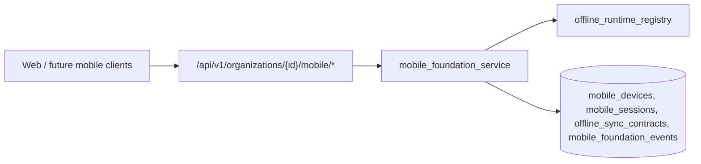

# P44-01 — Mobile / Offline Foundation

ComicOS P44-01 establishes the mobile and offline **platform foundation** without implementing scanning, convention workflows, quick-sale flows, offline inventory editing, conflict resolution, native apps, or device management policies.

## Architecture overview

The mobile foundation layer is organization-scoped and backend-authoritative:

- **Devices** register under an organization with a stable `(organization_id, device_identifier)` key.
- **Sessions** bind a user to a device for offline runtime context; starting a new session terminates prior active sessions on the same device.
- **Offline sync contracts** are append-only configuration payloads that future sync engines will honor (inventory, transaction, lookup, metadata).
- **Foundation events** provide immutable, append-only lineage for registration, updates, sessions, contracts, device presence, and unauthorized access attempts.

## Device model

`MobileDevice` fields:

| Field | Role |
| --- | --- |
| `device_identifier` | Stable client-provided key, unique per organization |
| `device_name` / `device_type` | Display and capability hints |
| `device_status` | `active`, `inactive`, or `suspended` (registry-validated transitions) |
| `last_seen_at` | Replay-safe presence timestamp |

Registration is idempotent on `device_identifier`: repeats emit `mobile_device_seen` instead of duplicating rows.

## Session model

`MobileSession` tracks `session_status` (`active`, `expired`, `terminated`) with deterministic ordering on `(started_at, id)`. Ending a session is append-only via `mobile_session_ended` events.

## Offline contract model

`OfflineSyncContract` stores `contract_type` (`inventory`, `transaction`, `lookup`, `metadata`) and a JSON payload. Contracts are never updated in place in this phase—new contracts append new rows and `offline_contract_created` events.

## Replay-safe guarantees

- List endpoints order by `(created_at, id)` or `(started_at, id)` ascending.
- Event history is append-only; no update/delete APIs on lineage tables.
- Timestamps use timezone-aware UTC storage.
- Foreign keys reference organizations, devices, and users without destructive cascades on delete.

## Event types (lineage)

- `mobile_device_registered`
- `mobile_device_updated`
- `mobile_device_seen`
- `mobile_session_started`
- `mobile_session_ended`
- `offline_contract_created`
- `unauthorized_mobile_access_attempt`

## Permissions

- View: `organization:view`
- Manage (register device, sessions, contracts, patch device): `organization:update`

Denied attempts record `unauthorized_mobile_access_attempt` before returning HTTP 403.

## Future offline dependencies

Later P44 phases can build on this foundation for:

- Local persistence adapters keyed by device and session
- Sync workers that consume `OfflineSyncContract` payloads
- Convention-mode and quick-sale workflows (not in P44-01)
- Barcode scanning and offline inventory (explicitly out of scope here)

## API surface (v1 envelope)

| Method | Path |
| --- | --- |
| GET | `/organizations/{organization_id}/mobile` |
| GET/POST | `/organizations/{organization_id}/mobile/devices` |
| PATCH | `/organizations/{organization_id}/mobile/devices/{device_id}` |
| GET/POST | `/organizations/{organization_id}/mobile/sessions` |
| GET/POST | `/organizations/{organization_id}/mobile/contracts` |

Engine tag: `mobile_foundation` → `P44-01` in scan API v1 metadata.
