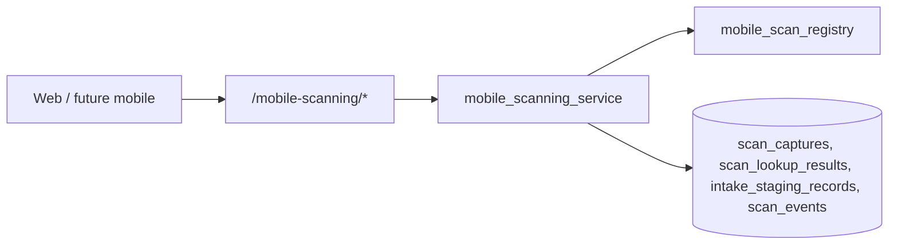

# P44-03 — Barcode / QR Scanning & Intake

P44-03 adds scan capture, normalization, deterministic multi-source lookup, intake staging, and append-only scan lineage for mobile operations. It does not implement camera hardware, OCR, convention mode, quick-sale checkout, or automatic inventory creation.

## Architecture

Capture flow:

1. **capture_scan** — record raw value on a registered device
2. **normalize_scan** — type-specific normalization (digits for UPC/barcode, trimmed QR, lowercase inventory identifiers)
3. **lookup_inventory** — deterministic ordered sources
4. Optional **intake staging** — pending → approved/archived

## Lookup model

`ScanLookupResult` rows are append-only. Sources (stable ordering):

| lookup_type | Source |
| --- | --- |
| `known_upc` | Frozen catalog in `mobile_scan_upc_registry` |
| `inventory_item` | Organization inventory assignment by numeric id, or offline local record identifier |
| `marketplace_listing` | Listing draft title exact match |
| `storefront_mapping` | Shopify product mapping identifier |

## Staging model

`IntakeStagingRecord` links to a `scan_capture_id` with statuses `pending`, `approved`, `archived`. Approving/archiving emits lineage events; no automatic inventory writes.

## Scan registry

- **Scan types:** `barcode`, `qr`, `upc`, `inventory_identifier`
- **Scan statuses:** `captured`, `lookup_complete`, `staged`, `rejected`
- **Staging statuses:** `pending`, `approved`, `archived`

## Replay-safe guarantees

- Lists ordered by `(created_at, id)` or `(queued_at, id)` equivalents
- `ScanEvent` append-only
- UTC timestamps on all rows
- Org-scoped FKs without destructive cascades

## Event types

- `scan_captured`
- `scan_normalized`
- `inventory_lookup_completed`
- `intake_record_created`
- `intake_record_approved`
- `intake_record_archived`
- `unauthorized_scan_access_attempt`

## Permissions

- View: `organization:view`
- Manage (capture, stage, approve/archive): `organization:update`

## Future camera integration dependencies

Later phases can attach device camera streams to the same **capture** API payload, add hardware-specific normalization plugins, and wire approved intake into inventory creation workflows—without changing the lineage tables introduced here.

## API (v1 envelope)

| Method | Path |
| --- | --- |
| GET | `/organizations/{organization_id}/mobile-scanning` |
| GET | `/organizations/{organization_id}/mobile-scanning/scans` |
| GET | `/organizations/{organization_id}/mobile-scanning/lookups` |
| GET | `/organizations/{organization_id}/mobile-scanning/staging` |
| POST | `/organizations/{organization_id}/mobile-scanning/capture` |
| POST | `/organizations/{organization_id}/mobile-scanning/staging` |
| PATCH | `/organizations/{organization_id}/mobile-scanning/staging/{staging_id}` |

Engine tag: `mobile_scanning` → `P44-03`.
