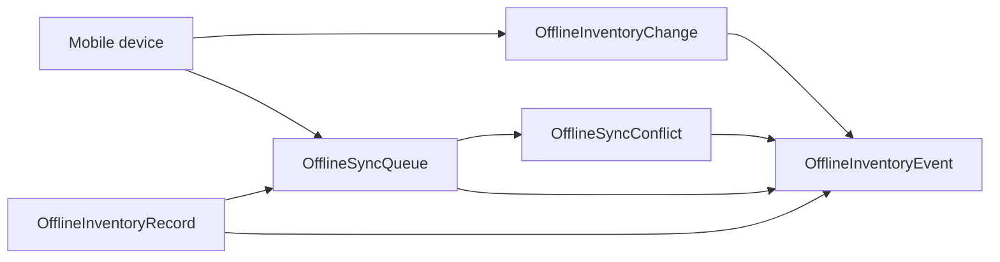

# P44-02 — Offline Inventory & Sync Engine

P44-02 adds deterministic offline inventory storage, change logging, sync queues, conflict tracking, and append-only lineage on top of the P44-01 mobile foundation. It does not implement barcode scanning, convention mode, quick-sale flows, automated conflict resolution, or marketplace changes.

## Architecture

Organization-scoped offline state mirrors local device operations while keeping the server authoritative for visibility and reconciliation:

## Offline inventory record

Each record is keyed by `(organization_id, local_record_identifier)`. Payloads live in `record_payload_json` with `local_updated_at` for replay-safe ordering. POST create is idempotent: repeating the same local identifier updates the record and emits `offline_inventory_updated`.

## Sync queue model

`OfflineSyncQueue` rows start in `pending` status with device-scoped payloads. Registry statuses: `pending`, `processing`, `completed`, `failed`. This phase enqueues only; workers and automated processing are future work.

## Conflict model

`OfflineSyncConflict` captures `local_payload_json` vs `server_payload_json` with statuses `open`, `acknowledged`, `resolved_manual`. PATCH updates status along deterministic transitions; no automatic merge or resolution.

## Change types

Append-only `OfflineInventoryChange` rows use registry types: `create`, `update`, `delete`, `lookup`.

## Replay-safe guarantees

- Lists order by `(created_at, id)` or `(queued_at, id)` ascending.
- `OfflineInventoryEvent` is append-only.
- Unauthorized access records `unauthorized_offline_inventory_access_attempt` before HTTP 403.

## Event types

- `offline_inventory_created`
- `offline_inventory_updated`
- `offline_change_registered`
- `sync_queue_item_created`
- `sync_conflict_detected`
- `sync_conflict_acknowledged`
- `unauthorized_offline_inventory_access_attempt`

## Permissions

Same as mobile foundation: view via `organization:view`, manage via `organization:update`.

## Future sync-resolution dependencies

Later phases can add queue processors, server reconciliation against canonical inventory, automated conflict policies, and convention/scan workflows—all consuming contracts and devices from P44-01 and records/queues from P44-02.

## API (v1 envelope)

| Method | Path |
| --- | --- |
| GET | `/organizations/{organization_id}/offline-inventory` |
| GET | `/organizations/{organization_id}/offline-inventory/changes` |
| GET | `/organizations/{organization_id}/offline-inventory/queue` |
| GET | `/organizations/{organization_id}/offline-inventory/conflicts` |
| POST | `/organizations/{organization_id}/offline-inventory` |
| POST | `/organizations/{organization_id}/offline-inventory/change` |
| POST | `/organizations/{organization_id}/offline-inventory/queue` |
| PATCH | `/organizations/{organization_id}/offline-inventory/conflicts/{conflict_id}` |

Engine tag: `offline_inventory_engine` → `P44-02`.
