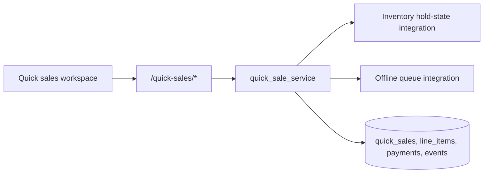

# P44-05 — Quick Sale / Dealer Transactions

P44-05 establishes ComicOS's internal quick-sale foundation for convention and mobile dealer workflows. It captures sales, line items, internal payment records, deterministic totals, inventory reservation/sold-state transitions, and offline queue hooks without introducing external payment processing, receipts, taxes, refunds, or marketplace sync.

## Architecture

## Sale lifecycle

| Status | Meaning |
| --- | --- |
| `draft` | Sale is still being assembled |
| `completed` | Inventory is internally marked sold |
| `voided` | Draft sale was cancelled internally |

Quick sales are idempotent per `(organization_id, sale_identifier)`.

## Line items

`QuickSaleLineItem` supports inventory-backed sales and optional references to offline inventory records or marketplace listing drafts. Current P44-05 behavior requires each line item to resolve to a concrete `inventory_item_id`, which enables deterministic inventory validation and sold-state handling.

Line-item statuses:

- `added`
- `removed`
- `sold`

## Payment-method recording

Payments are internal records only. Supported methods:

- `cash`
- `card_external`
- `venmo_external`
- `paypal_external`
- `other_external`

These methods record intent and amount only; ComicOS does not process any gateway payment in this phase.

## Inventory sale integration

Inventory ownership is validated through active `OrganizationInventoryAssignment` rows for the organization. Item state uses `InventoryCopy.hold_status`:

- `hold` → available
- `reserved_for_sale` → line item added to draft sale
- `sold_internal` → sale completed

Removing a draft line item or voiding a draft sale releases the reservation back to `hold`.

## Offline queue integration

Offline-ready sales use deterministic payload reconciliation on completion:

1. Serialize sale, line items, and payments into a stable payload
2. Register an `OfflineInventoryChange`
3. Queue an `OfflineSyncQueue` operation
4. Append `quick_sale_offline_queued`

No automatic conflict resolution is added beyond the existing P44-02 foundation.

## Deterministic totals

Totals are always recalculated from non-removed line items:

- `subtotal_amount = sum(quantity * unit_price)`
- `discount_amount = sum(line discount)`
- `total_amount = subtotal - discount`

All monetary values are normalized to two decimal places.

## Replay-safe guarantees

- Append-only `QuickSaleEvent` lineage
- Deterministic ordering on `(created_at, id)`
- Stable JSON serialization for event and offline payloads
- No destructive cascades
- Unauthorized attempts append `unauthorized_quick_sale_access_attempt`

## Event types

- `quick_sale_created`
- `quick_sale_line_item_added`
- `quick_sale_line_item_removed`
- `quick_sale_payment_recorded`
- `quick_sale_completed`
- `quick_sale_voided`
- `quick_sale_inventory_reserved`
- `quick_sale_inventory_sold`
- `quick_sale_offline_queued`
- `unauthorized_quick_sale_access_attempt`

## Future dependencies

This phase intentionally stops at internal transaction capture. Later phases can build:

- receipt generation
- tax calculation
- payment gateway handoff
- refunds
- fulfillment/shipping
- accounting sync

without changing the core sale/event lineage introduced here.
