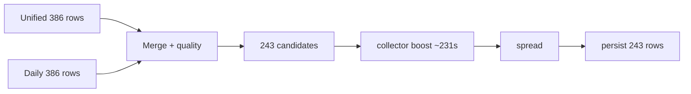

# P61-00B — Recommendation performance and spread certification audit

**Status:** Audit complete with targeted fixes (no ranking weight changes, no Recommendation V3).

**Evidence:** Local rebuild for owner **40** (`lunar-reimport-71b45643@example.com`) — ~300s rebuild pipeline, ~17m total `verify_cross_system_owner.py --rebuild --top 20` before P61-00B fixes.

**Related:** [P61_00_RECOMMENDATION_AUDIT_REPORT.md](P61_00_RECOMMENDATION_AUDIT_REPORT.md), `apps/api/scripts/verify_cross_system_owner.py`

---

## Executive summary

| Finding | Root cause | P61-00B action |
|--------|------------|----------------|
| `collector_significance_boost` ~231s / ~95% of cross-system build | Per-candidate DB-heavy enrichment (243× `build_recommendation_priority_enrichment` + `build_collector_significance_with_breakdown`); `scoring_ctx=None` forced repeated market/profile loads | One shared `RecommendationV2ScoringContext` per batch in `apply_collector_significance_priority_boost` |
| Rebuild ~238s for 243 snapshot rows | Cost scales with **candidate count** (243 after merge/quality), not snapshot row count; dominated by collector boost | Documented; further batching deferred |
| Post-rebuild verify ~8+ min extra | `build_recommendation_ranking_audit(refresh=False)` still called `build_cross_system_candidates`; `list_latest` ran `decision_for_cross_system` per snapshot row | Reuse `candidate_score_trace` from rebuild; `recompute_candidates=False`; `include_decisions=False` on verify reads |
| `spread_verification.pass: false` | (1) Duplicate `apply_confidence_spread_inplace` at persist vs single spread at audit rebuild; (2) audit trace keys used `title.lower()` instead of `normalize_recommendation_title_key` | Removed duplicate confidence spread on persist; aligned trace lookup keys |
| Persisted scores pre- or post-spread? | **Post-spread** — `priority_score` / `confidence_score` columns store `_priority_for_persist` / `_confidence_for_persist` (normalized spread values, not raw pre-spread) | Documented; tests in `test_cross_system_persist_priority.py` |

---

## 1. Why `collector_significance_boost` dominates runtime

### Call path

```
build_cross_system_candidates()
  → merge unified + daily (243 candidates after quality filter)
  → apply_collector_significance_priority_boost()   # ~231s observed
       for each candidate:
         resolve_release_pair(title, release_index)
         build_recommendation_priority_enrichment(...)   # franchise/publisher/continuity DB
         build_collector_significance_with_breakdown(...) # creators, milestones, homage
         mutate raw_priority_score / priority_score
  → apply_priority_spread_inplace()
  → apply_confidence_spread_inplace()
```

### Why it is slow

- **O(candidates)** with **no cross-candidate caching** before P61-00B (except `owned_stats` and `release_index`).
- Each iteration may hit popularity/market paths when `scoring_ctx` was `None` in `recommendation_intelligence_ranking.py`.
- Unified generation in the same rebuild also issued **~24k queries** (`build_drafts` timing); collector boost is the cross-system-specific hotspot.

### Targeted fix (P61-00B)

- Build **`build_recommendation_v2_scoring_context(session, owner_user_id)` once** per boost pass and pass `scoring_ctx` into `build_recommendation_priority_enrichment`.

### Not changed (by design)

- Collector boost weights, milestone tables, or franchise formulas.
- Per-candidate issue resolution (still 243×).

### Success metrics (future)

- `collector_significance_boost` p95 &lt; 60s for ~250 candidates on local DB.
- `scoring_ctx` reuse: single context build per cross-system candidate pass.

---

## 2. Why cross-system rebuild ~238s for 243 rows

Snapshot size **243** is the number of **persisted ranks** in the latest batch. Work is proportional to:

1. **Merged candidate pool** (772 unified+daily rows → 243 after dedupe + quality).
2. **Collector boost** (~231s).
3. **Spread + persist** (&lt;1s).

Unified + daily regeneration (when `--rebuild`) adds ~60s additional but is separate from the 238s cross-system timing line.



---

## 3. Why post-rebuild diagnostics rebuilt candidates

### Before P61-00B

`verify_cross_system_owner.py` after `--rebuild`:

1. `generate_cross_system_recommendations` → full `build_cross_system_candidates` + persist.
2. `list_latest_cross_system_recommendations` → decision engine per row (~231s observed for 243 rows).
3. `build_recommendation_ranking_audit(refresh=False)` → **another** full `build_cross_system_candidates` (~243s).

Step 3 existed because spread certification compares **persisted** rows to **recomputed** trace from live candidates (`recommendation_ranking_diagnostics.py`).

### P61-00B changes

| Component | Change |
|-----------|--------|
| `generate_cross_system_recommendations` | Writes `persist_audit["candidate_score_trace"]` from in-memory candidates after build (pre-persist). |
| `verify_cross_system_owner.py` | After rebuild, passes trace into audit with `recompute_candidates=False`. |
| `list_latest_cross_system_recommendations` | `include_decisions=False` for verify (skips RDE per row). |
| `build_recommendation_ranking_audit` | `recompute_candidates`, `score_trace`, `include_decisions` parameters. |

Read-only verify (no `--rebuild`) still recomputes candidates when no trace is supplied.

---

## 4. Why persisted vs recomputed spread fields mismatched

### Symptom

`spread_verification`: `top20_persisted_matches_confidence: false`, `top20_persisted_matches_spread: false`, `pass: false` even when Top 20 looked correctly spread (98.0 → 87.6).

### Causes

**A. Double confidence spread on persist**

- `build_cross_system_candidates` applied `apply_confidence_spread_inplace` once.
- `_persist()` called **`apply_confidence_spread_inplace` again** before insert.
- Audit trace rebuilt candidates with **one** spread → `computed_confidence_score` ≠ DB `confidence_score`.

**Fix:** Removed second `apply_confidence_spread_inplace` in persist; finalize helpers only align `candidate.priority_score` / `confidence_score` to normalized values.

**B. Trace key mismatch**

- `candidate_score_trace` keyed by `(type, title_key)` with `normalize_recommendation_title_key`.
- `audit_from_listed_items` looked up `(type, title.strip().lower())` → missing trace → null computed fields for some titles.

**Fix:** Audit lookup uses `normalize_recommendation_title_key(i.title)`.

### Priority persistence contract

| Field | Meaning |
|-------|---------|
| `raw_priority_score` (in-memory) | After collector boost, before spread |
| `normalized_priority_score` | Output of `apply_priority_spread_inplace` |
| DB `priority_score` | `_priority_for_persist()` → **normalized** unless `budget_priority_adjusted` |

| Field | Meaning |
|-------|---------|
| `raw_confidence_score` | Pre-spread confidence |
| `normalized_confidence_score` | Spread output |
| DB `confidence_score` | `_confidence_for_persist()` → **normalized** |

Persisted columns are **post-spread** (normalized), not raw pre-spread scores.

---

## 5. Spread certification gates (`verify_cross_system_owner.py`)

`spread_verification.pass` requires (among others):

- Top 20 raw/normalized trace populated.
- `distinct_score_count` &gt; 15, spread &gt; 10.
- `|persisted priority − computed_priority| &lt; 0.05` for each Top 20 row.
- Same for confidence (&lt; 0.01).
- Confidence diversity (not all 1.0).

After P61-00B fixes, rebuild + verify should align persisted and computed fields when using reused `candidate_score_trace`.

---

## 6. Files touched (P61-00B)

| File | Change |
|------|--------|
| `app/services/cross_system_recommendation_engine.py` | `candidate_score_trace_map`; trace in `persist_audit`; remove duplicate confidence spread on persist |
| `app/services/recommendation_intelligence_ranking.py` | Shared `scoring_ctx` for collector boost |
| `app/services/recommendation_ranking_diagnostics.py` | Trace key fix; optional `recompute_candidates` / `score_trace` |
| `app/services/cross_system_recommendation.py` | `include_decisions` flag on list |
| `scripts/verify_cross_system_owner.py` | Reuse trace; skip decisions on verify path |

---

## 7. Recommended verification commands

```bash
cd apps/api
export DATABASE_URL=...

# Full rebuild + spread cert (should be much faster post-00B)
python scripts/verify_cross_system_owner.py \
  --email lunar-reimport-71b45643@example.com --rebuild --top 20

# Read-only (still recomputes candidates for trace unless you add trace export)
python scripts/verify_cross_system_owner.py \
  --email lunar-reimport-71b45643@example.com --top 20
```

Check stderr timings: `collector_significance_boost`, `read.list_latest_cross_system_recommendations`, `compute.ranking_diagnostics`.

---

## 8. Deferred (not P61-00B)

- Recommendation V3 read/persist split on HTTP GET.
- Batching collector enrichment queries across candidates (issue-id cache).
- Skipping second `build_cross_system_candidates` on executive dashboard audit paths.
- Changing spread constants (`SPREAD_FLOOR` / `CONF_SPREAD_FLOOR`) or collector boost weights.
