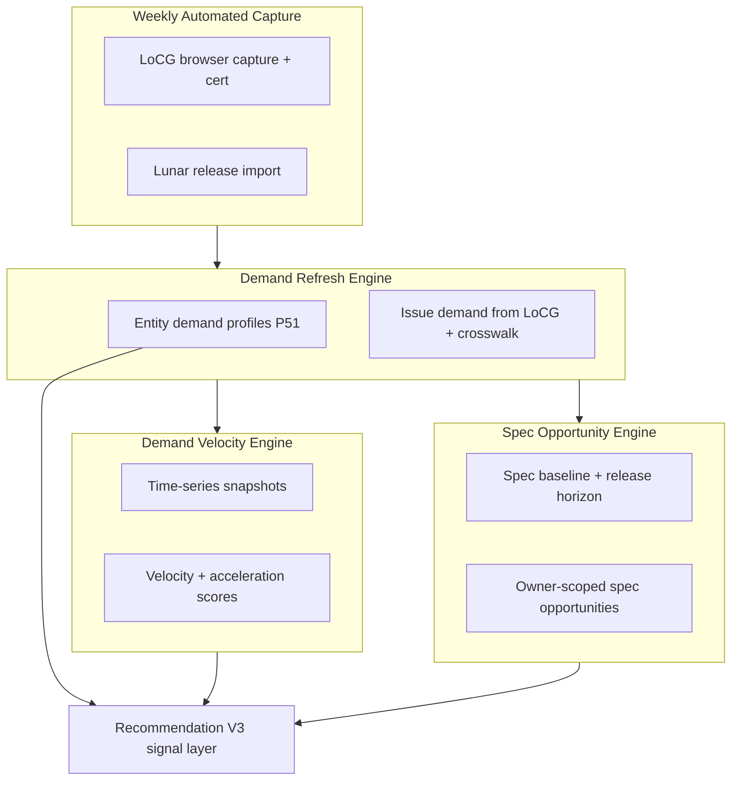
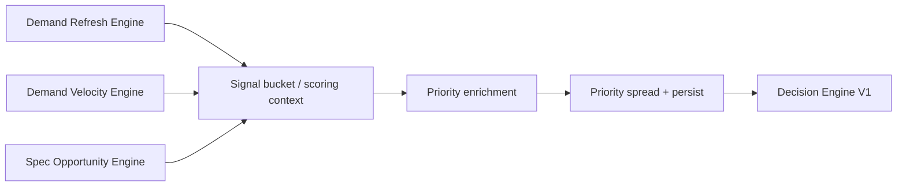

# P61 — Demand Intelligence Platform (architecture)

**Status:** Implemented (P61-01–P61-04). Recommendation V3 consumption is a follow-on phase.

**Implementation:** `apps/api/app/models/demand_intelligence.py`, services `demand_*_service.py`, `weekly_demand_automation_service.py`, API `apps/api/app/api/demand_intelligence_platform.py`, migrations `20260605_0219_add_p61_demand_intelligence.py` and merge `20260605_0220_merge_p61_and_collector_ratio_heads.py`.

**Scope:** Four platform components that turn external community demand, entity-level market priors, liquidity movement, and spec posture into durable signals for ranking, decisioning, and operations. Builds on P51-03 (`market_demand_*`, `collector_demand_score`), P50 release/spec lanes, P36 liquidity velocity, and LoCG external catalog (`external_catalog_*`, `decision_signals_json`).

**Related:**

- [EXTERNAL_CATALOG_LOCG.md](EXTERNAL_CATALOG_LOCG.md) — ingest workflows and weekly incremental scripts
- [EXTERNAL_CATALOG_RDE_SIGNAL_MAP.md](EXTERNAL_CATALOG_RDE_SIGNAL_MAP.md) — pull/want → `demand_score` in RDE bundle
- [P61_00_RECOMMENDATION_AUDIT_REPORT.md](P61_00_RECOMMENDATION_AUDIT_REPORT.md) — Recommendation V3 requirements
- [P61_00_GET_REFRESH_INVENTORY.md](P61_00_GET_REFRESH_INVENTORY.md) — read vs refresh contract (P61-00)

---

## Platform overview

**Design principles**

1. **Read vs write separation** — All consumer APIs default to persisted snapshots; regeneration is explicit POST (aligned with P61-00 industry/spec pattern).
2. **Deterministic scoring** — No ML retraining in P61; velocity and opportunity math use fixed formulas and versioned `source_version` / `engine_epoch` fields.
3. **Provenance** — Every issue-level demand score carries `signal_sources[]` (LoCG pull/want, entity rollup, liquidity proxy, manual seed).
4. **Owner boundaries** — Global demand tables are shared; spec opportunities and crosswalk matches remain owner-scoped where today’s schema already is.

---

## 1. Demand Refresh Engine

### Purpose

Recompute **current-state** demand intelligence on a schedule or on demand: entity-level profiles (character, franchise, creator) and **issue-level** community demand tied to `ReleaseIssue` where crosswalk exists. Merge P51 popularity/key-issue boosts with LoCG pull/want and refreshed `decision_signals_json`. This engine is the **authoritative “what is demand right now?”** layer; it does not compute week-over-week velocity (see §2).

### Inputs

| Source | Data |
|--------|------|
| P51 intelligence | `CharacterProfile`, `FranchiseProfile`, `CreatorProfile`, popularity score tables, `KeyIssueProfile` + `ReleaseIssue` / `ReleaseSeries` |
| P51 baselines | `MARKET_DEMAND_BASELINES` seed (`market_demand_seed`) |
| LoCG catalog | `external_catalog_issue` (`pull_count`, `want_count`, `release_date`, `foc_date`, normalized metadata) |
| RDE builder | `decision_signals.py` — recomputed `decision_signals_json` on normalize/refresh |
| Crosswalk | `external_catalog_match` → `release_issue_id` (per owner or global match table per current product rule) |
| Optional liquidity | Latest `ListingVelocitySnapshot` / inventory liquidity classification for entity names referenced on issue (proxy only in refresh phase) |

### Outputs

| Artifact | Description |
|----------|-------------|
| Entity profiles | Upserted `market_demand_profile` rows + append `market_demand_signal` rows (`signal_type` e.g. `P51_01_*`, `P61_ISSUE_ROLLUP`) |
| Collector composite | New or updated `collector_demand_score` rows when refresh policy includes collector lane |
| Issue demand snapshot | **Proposed** `issue_demand_snapshot` rows (see Database changes) — one current row per `(source_name, external_issue_id)` or per `release_issue_id` when matched |
| Issue signal bundle | Updated `external_catalog_issue.decision_signals_json` (`demand_score`, `demand_components`) |
| Run audit | **Proposed** `demand_refresh_run` — counts, duration, source_version, pass/fail gates |

### Database changes (proposed)

| Table | Role |
|-------|------|
| `demand_refresh_run` | Append-only job audit (`trigger_type`, `started_at`, `finished_at`, `profiles_updated`, `issues_refreshed`, `signals_appended`, `status`, `details_json`) |
| `issue_demand_snapshot` | Current issue-level demand: `release_issue_id` (nullable), `external_issue_id` (nullable), `pull_count`, `want_count`, `community_demand_score`, `entity_rollup_score`, `combined_demand_score`, `confidence_score`, `source_version`, `refreshed_at` |
| Existing writes | Continue upsert on `market_demand_profile`; append on `market_demand_signal` and `collector_demand_score` (no destructive deletes) |

No change to Lunar or inventory tables in this phase.

### API endpoints (implemented)

Prefix: `/api/v1/demand`. List GETs read **persisted** snapshots only; `POST /refresh` writes.

| Method | Path | Behavior |
|--------|------|----------|
| `GET` | `/dashboard` | Last refresh run, snapshot counts, top issue demand rows |
| `GET` | `/issues` | Paginated `IssueDemandSnapshot`; filters: `release_issue_id`, `min_combined_score` |
| `GET` | `/runs/latest` | Latest `DemandRefreshRun` |
| `POST` | `/refresh` | Scoped refresh (`scope`: `ENTITY`, `ISSUE_UPCOMING`, `ALL`; `days_forward` default 90). `refresh_locg` defaults false on API (no LoCG HTTP on GET path). |
| `GET` | `/certification` | Refresh engine certification |
| `GET` | `/platform/certification` | Bundle: refresh + velocity + spec + automation |

Entity profiles remain on P51 `/market-user-intelligence/*`. Batch `/refresh/issues` is a follow-on.

Auth: same as P51 — authenticated owner; global entity refresh may be operator-role in production.

### Scheduled jobs

| Job | Cadence | Action |
|-----|---------|--------|
| `demand_refresh_entity` | Daily 02:00 UTC | `scope=ENTITY` — P51 rollup + baselines |
| `demand_refresh_upcoming` | Daily 06:00 UTC | `scope=ISSUE_UPCOMING`, `days_forward=90` — LoCG signal refresh path (equivalent to `refresh_locg_upcoming_signals.py`) + issue snapshot upsert |
| `demand_refresh_post_capture` | Event-driven | Enqueued after successful Weekly Automated Capture (§4) for the captured release week only |

### Success metrics

| Metric | Target (initial) |
|--------|------------------|
| Upcoming-window coverage | ≥ 95% of `ReleaseIssue` in FOC/release window have `issue_demand_snapshot` or documented `NOT_MATCHED` crosswalk reason |
| Staleness | Median `refreshed_at` age for upcoming issues &lt; 36h |
| Entity profile count | Stable or growing with catalog; zero duplicate `(entity_type, entity_name)` |
| Signal append rate | `signals_appended / profiles_updated` ≥ 1.0 on entity refresh |
| Refresh job success rate | ≥ 99% weekly; failed runs expose `status=FAILED` on `/runs/latest` |
| Decision bundle completeness | ≥ 90% of refreshed LoCG issues have non-null `demand_components` in `decision_signals_json` |

---

## 2. Demand Velocity Engine

### Purpose

Measure **change over time** in demand signals: week-over-week (or capture-to-capture) deltas for LoCG pull/want, entity profile demand scores, and optional listing-velocity medians for matched inventory. Produces velocity, acceleration, and trend labels (`RISING`, `STABLE`, `FALLING`, `INSUFFICIENT_HISTORY`) used to boost or dampen recommendation priority without replacing the level signal from §1.

### Inputs

| Source | Data |
|--------|------|
| Demand Refresh | Historical `issue_demand_snapshot` rows (or dedicated history table — see DB) |
| LoCG history | **Proposed** `issue_demand_observation` append-only points per capture/refresh |
| Entity history | Prior `market_demand_signal` rows or **proposed** `entity_demand_observation` |
| Liquidity | `ListingVelocitySnapshot` time series for SKUs/issues linked to `release_issue_id` |
| Calendar | Release week boundaries (Wednesday ship dates) for normalization |

### Outputs

| Artifact | Description |
|----------|-------------|
| Issue velocity | **Proposed** `issue_demand_velocity` — `release_issue_id`, `window_days`, `pull_delta`, `want_delta`, `combined_score_delta`, `velocity_score` (0–100), `acceleration_score`, `trend_label`, `confidence_score`, `computed_at` |
| Entity velocity | **Proposed** `entity_demand_velocity` — parallel structure for `market_demand_profile.id` |
| Velocity run audit | **Proposed** `demand_velocity_run` — append-only |
| API aggregates | Top movers (gainers/losers), franchise-level rollups |

### Database changes (proposed)

| Table | Role |
|-------|------|
| `issue_demand_observation` | Append-only: `external_issue_id`, `release_issue_id`, `observed_at`, `pull_count`, `want_count`, `community_demand_score`, `capture_run_id` (nullable FK to sync/capture run) |
| `entity_demand_observation` | Append-only: `profile_id`, `demand_score`, `observed_at` |
| `issue_demand_velocity` | Latest velocity row per `(release_issue_id, window_days)`; upsert semantics |
| `entity_demand_velocity` | Latest per `(profile_id, window_days)` |
| `demand_velocity_run` | Job audit |

Retention policy (design): keep observations 52 weeks; aggregate older into monthly buckets (future phase).

### API endpoints (implemented)

Prefix: `/api/v1/velocity`

| Method | Path | Behavior |
|--------|------|----------|
| `GET` | `/issues` | Paginated `DemandVelocitySnapshot` for `window_days` (default 7) |
| `POST` | `/compute` | Recompute windows (default 7/14/28) from `IssueDemandObservation` history |
| `GET` | `/certification` | Velocity engine certification |

Entity velocity, movers, and per-issue detail endpoints are follow-ons for V3 transparency.

### Scheduled jobs

| Job | Cadence | Action |
|-----|---------|--------|
| `demand_velocity_compute` | Daily 07:30 UTC | After `demand_refresh_upcoming`; windows 7/14/28 days |
| `demand_velocity_post_capture` | Event-driven | Insert observation from capture totals; recompute velocity for affected release week |

### Success metrics

| Metric | Target (initial) |
|--------|------------------|
| Observation linkage | ≥ 80% of certified capture weeks produce ≥ 1 observation per parent issue in that week |
| History depth | ≥ 4 observations per top-100 upcoming issues before `trend_label` used in V3 |
| Compute latency | p95 `demand_velocity_run` duration &lt; 5 min on production catalog size |
| False stability rate | Manual audit sample: &lt; 5% `STABLE` when pull/want changed &gt; 15% |
| V3 readiness | Velocity fields present on ≥ 70% of cross-system candidate pool when enabled |

---

## 3. Spec Opportunity Engine

### Purpose

Rank **owner-scoped** spec and preorder opportunities by combining release-horizon intelligence (P50), spec baseline scores, demand refresh/velocity outputs, and user preference fit. Produces a persisted opportunity list distinct from cross-system Top N but feedable into it (PREORDER / spec-type rows).

### Inputs

| Source | Data |
|--------|------|
| Release catalog | Owner `ReleaseIssue`, `ReleaseSeries`, `release_variant`, FOC/release dates |
| Spec lane | `spec_baseline_score`, `spec_score`, `spec_recommendation` (P50-03) |
| Horizons | `release_horizon_engine` / opportunity intelligence buckets |
| Demand Refresh | `issue_demand_snapshot.combined_demand_score`, `decision_signals_json` catalysts |
| Demand Velocity | `issue_demand_velocity.velocity_score`, `trend_label` |
| User fit | `UserPreferenceProfile` / scores (P51-03), inventory gaps, collection continuity |
| Industry scanner | Latest `IndustryScannerAutomationRun` status (optional gate for freshness) |

### Outputs

| Artifact | Description |
|----------|-------------|
| Opportunity snapshot | **Proposed** `spec_opportunity_snapshot` — owner-scoped header (`snapshot_at`, `engine_epoch`, `row_count`) |
| Opportunity rows | **Proposed** `spec_opportunity_row` — `release_issue_id`, `opportunity_score`, `spec_baseline_score`, `demand_score`, `velocity_score`, `preference_fit_score`, `horizon_bucket`, `rationale_json`, `rank` |
| Run audit | **Proposed** `spec_opportunity_run` |

### Database changes (proposed)

| Table | Role |
|-------|------|
| `spec_opportunity_snapshot` | Owner FK, append-only snapshot metadata |
| `spec_opportunity_row` | Child rows; FK to snapshot; indexed by `(owner_user_id, rank)` |
| `spec_opportunity_run` | Build audit linking to snapshot id |

Existing `spec_baseline_score` and P50 tables remain source of truth for spec math; this engine **reads** them, does not redefine baseline formulas.

### API endpoints (implemented)

Prefix: `/api/v1/spec`

| Method | Path | Behavior |
|--------|------|----------|
| `GET` | `/latest` | Latest owner `SpecOpportunitySnapshot` with embedded paginated rows |
| `POST` | `/build` | Rebuild snapshot (`SpecOpportunityRow` ranked list) |
| `GET` | `/certification` | Spec engine certification (owner-scoped) |

Empty catalog: structured `NOT_READY` envelope (aligned with V3 § below), not silent `[]`.

### Scheduled jobs

| Job | Cadence | Action |
|-----|---------|--------|
| `spec_opportunity_build` | Daily 08:00 UTC per active owner (or batched queue) | After demand refresh + velocity |
| `spec_opportunity_post_lunar` | Event-driven | Trigger on successful Lunar import for owner |

### Success metrics

| Metric | Target (initial) |
|--------|------------------|
| Snapshot freshness | Latest snapshot age &lt; 26h for active owners |
| Coverage | When owner has ≥ 20 forward-window issues, snapshot row_count ≥ min(20, eligible count) |
| Score spread | Top 20 `opportunity_score` spread ≥ 15 points (mirrors cross-system spread verification) |
| Rationale completeness | 100% rows include `demand_score` and `horizon_bucket` in `rationale_json` |
| Spec alignment | ≥ 85% of top-10 opportunities have `spec_baseline_score` ≥ owner median baseline |

---

## 4. Weekly Automated Capture

### Purpose

Operations **orchestration** for the Wednesday LoCG release cycle: discover new calendar weeks, run browser capture with certification, optionally skip expensive crosswalk on ingest-only paths, persist external catalog + demand observations, and enqueue Demand Refresh / Velocity follow-ups. This is not a separate scoring engine; it is the **reliable data supply chain** for community demand.

### Inputs

| Source | Data |
|--------|------|
| Calendar | Next Wednesday release date(s); max stored `release_date` for LoCG (`sync_locg_new_weeks.py` logic) |
| Runtime config | `DATABASE_URL`, production flag, owner email for crosswalk (`ofoy@att.net` or per-env), throttle (`--adaptive-delay`), `--skip-crosswalk` default policy |
| Artifacts | `data/locg_browser_capture/<date>/locg_capture_certification.json` |
| Preconditions | `external_catalog_source` LoCG row; browser automation environment |

### Outputs

| Artifact | Description |
|----------|-------------|
| Catalog persist | `external_catalog_issue` / variants / creators; `external_catalog_sync_run` |
| Certification | Pass/fail JSON; completeness/persistence/runtime sections |
| Capture summary | stdout JSON summary (`crosswalk_skipped`, timings) |
| Downstream triggers | Messages or job records for `demand_refresh_post_capture`, `demand_velocity_post_capture` |
| Ops report | **Proposed** `weekly_capture_report` row or doc artifact in `docs/` for human sign-off |

### Database changes (proposed)

| Table | Role |
|-------|------|
| `weekly_capture_schedule` | `release_date`, `status` (`PENDING`, `RUNNING`, `CERTIFIED`, `FAILED`), `certification_path`, `sync_run_id`, `owner_user_id` |
| `weekly_capture_event` | Append-only step log (discovery, capture start/end, refresh enqueue) |

Reuses existing `external_catalog_sync_run`; no schema change required for minimal implementation.

### API endpoints (implemented)

Prefix: `/api/v1/automation` (operator-facing)

| Method | Path | Behavior |
|--------|------|----------|
| `GET` | `/schedule` | `WeeklyDemandCaptureSchedule` rows |
| `POST` | `/discover` | Discover upcoming Wednesdays + sync from catalog |
| `POST` | `/schedule/{release_date}/run` | Post-capture pipeline: demand refresh + velocity (browser capture remains script-driven) |
| `GET` | `/certification` | Weekly automation certification |

Owner-facing UI may remain script-first in early phase; API mirrors runbook for automation.

### Scheduled jobs

| Job | Cadence | Action |
|-----|---------|--------|
| `locg_discover_new_weeks` | Weekly Mon 12:00 UTC | `sync_locg_new_weeks.py --production` |
| `locg_capture_release_week` | Weekly Tue 22:00 UTC (configurable TZ) | `capture_locg_date_details_browser.py` for target Wednesday; `--skip-crosswalk` per ops policy; certification required |
| `locg_crosswalk_repair` | Weekly Wed 10:00 UTC (optional) | Separate job with `--run-crosswalk` for owners needing match repair |

Human gate (design): production certification FAIL blocks `demand_refresh_post_capture` for that date.

### Success metrics

| Metric | Target (initial) |
|--------|------------------|
| Certification pass rate | ≥ 95% of scheduled weeks PASS queue-v1 completeness |
| Parent/variant persist | Match certification thresholds (e.g. list variants persisted ≥ 99% of found) |
| Runtime | p95 capture within agreed ops window (e.g. &lt; 4h with adaptive throttle) |
| Time to refresh | Demand refresh post-capture completes within 2h of CERTIFIED |
| Incident rate | &lt; 1 manual remediation doc per month (see LoCG remediation pattern) |

---

## Integration with Recommendation V3

Recommendation V3 (per [P61_00_RECOMMENDATION_AUDIT_REPORT.md](P61_00_RECOMMENDATION_AUDIT_REPORT.md) §6) is the **consumer** of demand intelligence. No V3 module exists yet; this section defines how P61 signals attach without prescribing final weight constants.

### Signal flow

### Integration points

| V3 concern | P61 contribution |
|------------|------------------|
| **Scoring context** | Extend `build_recommendation_v2_scoring_context` (or V3 successor) to load `issue_demand_snapshot` + `issue_demand_velocity` by `release_issue_id` instead of only entity name fuzzy match on `MarketDemandProfile`. |
| **Market user blob** | Add `community_pull_want_score`, `demand_velocity_score`, `demand_trend_label` alongside existing `market_demand_score`, `liquidity_score`, `combined_market_user_score` in fit dict (`recommendation_priority_enrichment`, `recommendation_v2_components`). |
| **Signal buckets** | Map level + velocity into `market_demand` bucket (A/B/C) in `recommendation_signal_bucket_*`: e.g. rising community demand + high entity rollup → upgrade bucket; `INSUFFICIENT_HISTORY` → neutral. |
| **Cross-system candidates** | `build_cross_system_candidates` may ingest top spec opportunity rows as typed candidates (`PREORDER` / spec) with explicit `source=P61_SPEC_OPPORTUNITY`. |
| **RDE / decision layer** | Merge LoCG `decision_signals_json` with P61 issue snapshot at decision time (`compute_recommendation_decision`): `demand_score` uses combined level; `preorder_urgency` uses velocity acceleration for FOC-window issues. |
| **Read vs refresh** | V3 GET endpoints use persisted cross-system + demand snapshots only; POST `/api/v1/demand/refresh` and `/api/v1/spec/build` do not run on GET. |
| **NOT_READY** | If owner lacks `ReleaseIssue` rows or demand snapshots older than SLA, V3 returns structured `NOT_READY` with `reason_codes` (`NO_RELEASE_CATALOG`, `STALE_DEMAND`, `CAPTURE_FAILED`). |
| **Transparency API** | V3 breakdown JSON includes `demand_intelligence` section: level scores, velocity deltas, observation timestamps, `signal_sources`, link to `external_catalog_issue.id`. |
| **Certification** | Spread verification gates include optional check: top 20 contains ≥ N issues with non-null `demand_velocity_score` once P61 is enabled. |

### Weighting policy (design placeholder)

- **Level vs velocity:** Level (`combined_demand_score`) caps priority contribution; velocity acts as a bounded multiplier (e.g. ±10% priority) until calibrated.
- **Spec opportunity:** Rows above owner threshold enter candidate pool; they do not bypass catalog quality filters (`recommendation_catalog_quality`).
- **Feature flag:** `P61_DEMAND_SIGNALS_ENABLED` per owner or globally for gradual rollout.

### Explicit non-goals for V3 integration

- Changing Lunar import or inventory allocation.
- Replacing P50 spec baseline formulas.
- Running LoCG capture inside cross-system GET handlers.

---

## Cross-component dependencies

| Upstream | Downstream | Contract |
|----------|------------|----------|
| Weekly Automated Capture | Demand Refresh | Certified week id list → `scope=ISSUE_UPCOMING` for affected dates only |
| Demand Refresh | Demand Velocity | Observations written on each issue refresh |
| Demand Refresh + Velocity | Spec Opportunity | Latest level + velocity required before `/build` |
| P51 `/market-user-intelligence/refresh` | Demand Refresh | Entity slice may remain callable independently; P61 refresh supersedes for issue-level |
| LoCG `decision_signals_json` | V3 Decision Engine | Field map per RDE signal map doc |

---

## Phase rollout

**Delivered (integrated P61-01–04):** models, four services, `/demand`, `/velocity`, `/spec`, `/automation` APIs, per-component + platform certification, tests `test_demand_intelligence_platform.py`.

**Follow-on:** Recommendation V3 scoring context + feature flag; movers/entity velocity APIs; optional `POST /demand/refresh/issues`; UI navigation.

---

## Glossary

| Term | Meaning |
|------|---------|
| **Community demand** | LoCG pull/want and derived `community_demand_score` |
| **Entity rollup** | P51 franchise/creator/character profile demand applied to an issue via text/entity linkage |
| **Velocity** | Normalized delta over `window_days`, not absolute level |
| **Opportunity** | Owner-ranked spec/preorder row from Spec Opportunity Engine |
| **Capture week** | Wednesday `release_date` LoCG list + detail browser run |
