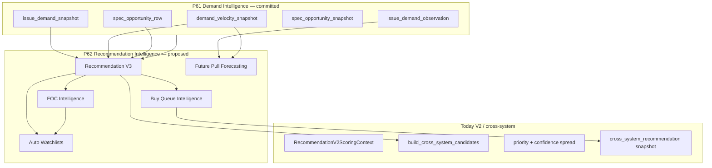
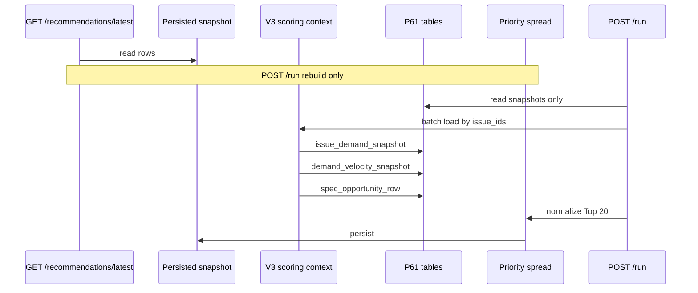

# P62 — Recommendation Intelligence Platform (architecture)

**Status:** Phases **1–5** implemented (V3 preview, Buy Queue, FOC, Pull Forecast, Auto Watchlists). **V3 production persistence** and P63 remain out of scope.

**Phase docs:**

- [P62_PHASE_1_RECOMMENDATION_V3_PREVIEW.md](P62_PHASE_1_RECOMMENDATION_V3_PREVIEW.md)
- [P62_PHASE_2_BUY_QUEUE_INTELLIGENCE.md](P62_PHASE_2_BUY_QUEUE_INTELLIGENCE.md)
- [P62_PHASE_3_FOC_INTELLIGENCE.md](P62_PHASE_3_FOC_INTELLIGENCE.md)
- [P62_PHASE_4_FUTURE_PULL_FORECASTING.md](P62_PHASE_4_FUTURE_PULL_FORECASTING.md)
- [P62_PHASE_5_AUTO_WATCHLISTS.md](P62_PHASE_5_AUTO_WATCHLISTS.md)

**Certification:** [P62_COLLECTOR_INTELLIGENCE_CERTIFICATION_REPORT.md](P62_COLLECTOR_INTELLIGENCE_CERTIFICATION_REPORT.md)

**Context:** LoCG ingestion is **closed** (catalog supply via certified capture + refresh only). P61 Demand Intelligence is **certified** and committed at **`4ac6045`**. P62 is the consumer layer: ranking, queues, FOC ops, pull forecasting, and watchlists powered by persisted P61 signals.

**Related:**

- [P61_DEMAND_INTELLIGENCE_PLATFORM.md](P61_DEMAND_INTELLIGENCE_PLATFORM.md) — upstream signals (refresh, velocity, spec, automation)
- [P61_DEMAND_INTELLIGENCE_CERTIFICATION_REPORT.md](P61_DEMAND_INTELLIGENCE_CERTIFICATION_REPORT.md) — P61 certification evidence
- [P61_00_RECOMMENDATION_AUDIT_REPORT.md](P61_00_RECOMMENDATION_AUDIT_REPORT.md) — V2 limitations and V3 requirements
- [P61_00B_RECOMMENDATION_PERFORMANCE_AND_SPREAD_AUDIT.md](P61_00B_RECOMMENDATION_PERFORMANCE_AND_SPREAD_AUDIT.md) — spread + performance gates
- [P61_00_GET_REFRESH_INVENTORY.md](P61_00_GET_REFRESH_INVENTORY.md) — read vs refresh contract

**Explicit non-goals (P62 spec phase):** migrations, models, scoring code changes, Recommendation V3 implementation, LoCG capture changes, P50 spec baseline formula changes.

---

## Platform overview



**Design principles**

1. **Read persisted, write explicit** — All owner-facing GETs return snapshots (`cross_system_recommendation`, `buy_queue_snapshot`, `foc_alert_snapshot`, etc.). Regeneration is POST-only (extends P61-00 pattern).
2. **Issue-first demand** — V3 resolves `release_issue_id` → P61 rows; entity-name fuzzy `MarketDemandProfile` match remains a fallback when crosswalk is missing.
3. **Composable intelligence** — V3, buy queue, FOC, pull forecast, and auto watchlists share one **`RecommendationIntelligenceContext`** loader (P61 + V2 caches) per owner rebuild.
4. **Certification before rollout** — Spread verification, P61 freshness, and P62 component certs gate feature flags.

---

## 1. Current V2 limitations (from P61-00 audit)

These gaps motivate P62/V3; **V2 behavior is unchanged until P62 implementation**.

| Area | Current behavior (V2 / cross-system) | Limitation |
|------|--------------------------------------|------------|
| **GET side effects** | `GET /api/v1/cross-system-recommendations` calls `refresh_and_list_latest_cross_system_recommendations` | Violates read/write separation; slow and non-deterministic for audits |
| **Empty owner** | Test owner (`ofoy@att.net`) with 0 `ReleaseIssue` → empty lists | No structured `NOT_READY`; certification cannot pass |
| **Market demand** | `score_release_market_user_fit` uses text match on `MarketDemandProfile` | No `issue_demand_snapshot.combined_demand_score` or LoCG pull/want |
| **Velocity / trend** | Not in cross-system priority or V2 component bundle | Cannot boost FOC-window risers or dampen falling demand |
| **Spec opportunities** | P50 spec agents + unified/daily; not P61 `spec_opportunity_row` | Duplicate logic; opportunity rank not in candidate merge |
| **Transparency** | Priority trace + collector boost breakdown | No `demand_intelligence` section; decision engine not on all Top N rows |
| **Performance** | `collector_significance_boost` ~95% of rebuild (P61-00B mitigated via `scoring_ctx`) | Still O(candidates); no batch issue-demand preload |
| **Spread / persist** | P61-00B aligned persist vs audit keys | Certification must stay green when V3 adds signals |
| **Buy queue** | `build_future_buy_queue` — ephemeral, spec-tier scores only | Not ranked with P61; not persisted; no queue run audit |
| **FOC** | `foc_dashboard`, watchlist `foc_reminders` agent | Not unified with demand velocity or V3 priority |
| **Pull forecast** | No first-class service | Observations exist in P61 but no owner forecast artifact |
| **Auto watchlists** | `auto_watchlist_agent` from inventory heuristics | No demand/spec/FOC-driven watchlists |

**Reference pipeline today** (`cross_system_recommendation_engine.py`):

`unified_collector_intelligence` + `daily_action_engine` → merge → quality filter → `apply_collector_significance_priority_boost` (uses `build_recommendation_v2_scoring_context`) → priority spread → confidence spread → persist.

V3 **inserts** a P61-aware scoring pass **before** spread, without removing V2 spec/unified lanes until cutover.

---

## 2. Recommendation V3 — scoring model

### 2.1 Purpose

**Recommendation V3** is the ranked Top-N engine that:

- Consumes **P61 issue-level** demand, velocity, and spec opportunity rows.
- Extends **V2 component math** (`recommendation_v2_components.score_issue_components_v2`) with new components and context fields.
- Feeds **cross-system candidate pool** (PREORDER / ACQUIRE / WATCH) with explicit provenance.
- Produces **persisted** snapshots + **full breakdown JSON** for audit (`verify_cross_system_owner.py` successor).

### 2.2 Scoring context (proposed)

Replace/extend `RecommendationV2ScoringContext` with **`RecommendationV3ScoringContext`**:

| Cache field | Source |
|-------------|--------|
| `demand_by_release_issue_id` | Latest `IssueDemandSnapshot` by `release_issue_id` |
| `demand_by_external_issue_id` | Same table keyed by `external_issue_id` (fallback) |
| `velocity_by_release_issue_id` | `DemandVelocitySnapshot` for windows 7/14/28 (primary: 7d for ranking, 28d for confidence) |
| `spec_opportunity_by_release_issue_id` | Latest owner `SpecOpportunityRow` joined to latest `SpecOpportunitySnapshot` |
| `observation_depth_by_external_issue_id` | Count of `IssueDemandObservation` in last 28d (for `INSUFFICIENT_HISTORY`) |
| *(unchanged V2)* | `market_demand_profiles`, variants, key issues, user prefs, watchlists, match catalog |

**Loader:** `build_recommendation_v3_scoring_context(session, owner_user_id, issue_ids)` — single query batch per rebuild (mirrors P61-00B `scoring_ctx` pattern).

**Join rule:** For each `ReleaseIssue.id`:

1. Prefer snapshot where `release_issue_id = issue.id`.
2. Else resolve `external_catalog_match` → `external_issue_id` → snapshot/velocity.
3. Else mark `demand_intelligence_status = NOT_MATCHED` in breakdown (no silent 50.0 without flag).

### 2.3 V3 score layers

V3 computes **three coupled scores** per candidate issue (aligned with existing persist columns):

| Layer | Meaning | Primary inputs |
|-------|---------|----------------|
| **Base priority** | Catalog + collector significance (today’s raw pre-spread) | Unified/daily/spec lanes, collector boost |
| **Intelligence adjustment** | Bounded delta from P61 + V2 components | Demand level, velocity, spec opportunity, V2 `MARKET_DEMAND_SCORE` refresh |
| **Decision overlay** | `compute_recommendation_decision` | RDE + P61 `decision_signals_json` via external catalog link |

**Formula (design — calibration in implementation phase):**

```text
raw_v3_priority = clamp(
  base_priority
  + demand_level_adjustment(combined_demand_score, confidence_score)
  + velocity_adjustment(velocity_score, trend_label, horizon_bucket)
  + spec_opportunity_adjustment(opportunity_score, rank)
  + v2_component_delta(issue_component_bundle)   # optional shrink if redundant with P61
)
```

Then existing **`apply_priority_spread_inplace`** / **`apply_confidence_spread_inplace`** run unchanged until a dedicated V3 spread epoch is introduced.

### 2.4 New / revised V2 components (V3 epoch)

Extend `COMPONENT_NAMES` with P61-aware components (weights are **initial design**; sum with existing weights must re-normalize to 1.0 in implementation):

| Component | Weight (proposed) | Input |
|-----------|-------------------|--------|
| `COMMUNITY_DEMAND_SCORE` | 0.08 | `IssueDemandSnapshot.community_demand_score`, pull/want |
| `ISSUE_DEMAND_LEVEL_SCORE` | 0.10 | `combined_demand_score` (replaces part of fuzzy `MARKET_DEMAND_SCORE` when matched) |
| `DEMAND_VELOCITY_SCORE` | 0.06 | `DemandVelocitySnapshot.velocity_score` (7d window) |
| `DEMAND_ACCELERATION_SCORE` | 0.03 | `acceleration_score` when `trend_label=RISING` |
| `SPEC_OPPORTUNITY_SCORE` | 0.07 | `SpecOpportunityRow.opportunity_score` if present |
| `MARKET_DEMAND_SCORE` (V2) | 0.08 ↓ from 0.12 | Entity rollup only when issue snapshot missing |

**Risk adjustments:**

- `trend_label=FALLING` + FOC within 14d → increase `RISK_SCORE` contribution cap.
- `INSUFFICIENT_HISTORY` → velocity/acceleration weights treated as 0; use level only.

### 2.5 Candidate ingestion

| Source | V3 action |
|--------|-----------|
| Unified / daily (existing) | Keep merge; annotate `source_systems` |
| P61 spec top-N | Inject rows with `recommendation_type=PREORDER`, `source=P61_SPEC_OPPORTUNITY`, floor priority from `opportunity_score` |
| Buy queue (P62-02) | Optional injection of `MUST_BUY` rows not already in pool |
| Quality filter | Unchanged (`recommendation_catalog_quality`, title index) |

### 2.6 NOT_READY contract

`GET` list endpoints return **424 or 200 with envelope `status=NOT_READY`** when:

| `reason_code` | Condition |
|---------------|-----------|
| `NO_RELEASE_CATALOG` | 0 forward-window `ReleaseIssue` for owner |
| `NO_CROSS_SYSTEM_SNAPSHOT` | No persisted V3/cross-system snapshot |
| `STALE_DEMAND` | Median `issue_demand_snapshot.refreshed_at` &gt; SLA (e.g. 36h) for upcoming window |
| `STALE_SPEC_OPPORTUNITY` | No owner spec snapshot in 26h |
| `P61_PLATFORM_NOT_CERTIFIED` | Ops gate (optional strict mode) |

---

## 3. Signal buckets and weights

### 3.1 Market demand buckets (A / B / C)

Formalize diagnostic buckets (`recommendation_signal_bucket_diagnostic`) for **runtime** V3:

| Bucket | Rule (issue matched to P61) |
|--------|-----------------------------|
| **A** | `combined_demand_score >= 72` AND (`velocity_score >= 60` OR `trend_label=RISING`) |
| **B** | `combined_demand_score >= 55` OR (`velocity_score >= 55` AND `trend_label != FALLING`) |
| **C** | Below B thresholds OR `NOT_MATCHED` / `INSUFFICIENT_HISTORY` with low level |

**Priority influence:**

| Bucket | Priority multiplier (bounded) |
|--------|-------------------------------|
| A | ×1.08 (+ up to +6.0 flat before spread) |
| B | ×1.02 |
| C | ×0.98 (neutral if `NOT_MATCHED` and strong key-issue) |

### 3.2 Spec opportunity tiers

From `SpecOpportunityRow.rank` and `horizon_bucket`:

| Tier | Condition | Priority floor |
|------|-----------|----------------|
| **S** | rank ≤ 10 AND `horizon_bucket=FOC_URGENT` | 85 |
| **1** | rank ≤ 20 | 78 |
| **2** | rank ≤ 50 | 70 |
| **—** | not in snapshot | no floor |

Floors apply **before** spread; they do not bypass quality filter.

### 3.3 Cross-system type weights (unchanged philosophy)

| Type | Role |
|------|------|
| PREORDER | FOC/release horizon + spec + demand |
| ACQUIRE | Inventory gap + demand velocity for backfill |
| WATCH | Rising demand without owner fit |

Budget awareness (`_apply_budget_awareness`) remains; V3 adds **demand-aware** exemption when `bucket=A` and FOC ≤ 7d.

---

## 4. Demand level, velocity, and spec in ranking



| Signal | Level use | Velocity use | Spec use |
|--------|-----------|--------------|----------|
| **FOC ≤ 7d** | `combined_demand_score` drives urgency copy | `acceleration_score` boosts preorder | `FOC_URGENT` tier floor |
| **Forward 90d** | Entity rollup backfill if issue null | 28d window in confidence | Opportunity rank in merge |
| **ACQUIRE** | Community pull/want vs inventory gap | `FALLING` dampens | Low spec baseline → demote |
| **Decision engine** | `demand_score` = combined level | `preorder_urgency` += f(velocity) | `rationale_json` keys surfaced |

**Observation series:** `issue_demand_observation` is not used in static ranking directly; it feeds velocity (P61-02) and **Future Pull Forecasting** (P62-04).

---

## 5. Buy Queue Intelligence (P62-02)

### 5.1 Purpose

Persisted, owner-scoped **buy queue** that ranks forward-window issues for purchasing/preorder — superseding ephemeral `build_future_buy_queue` over time (adapter period: V3 reads computed queue until snapshot exists).

### 5.2 Data model (proposed)

| Table | Role |
|-------|------|
| `buy_queue_snapshot` | Header: `owner_user_id`, `snapshot_at`, `engine_epoch`, `row_count`, `source_version` |
| `buy_queue_row` | `release_issue_id`, `rank`, `buy_category` (`MUST_BUY`, `STRONG_BUY`, `WATCH`, `PASS`), `ranking_score`, `horizon_window` (`NEXT_30_DAYS`, …), `rationale_json` |
| `buy_queue_run` | Audit: trigger, duration, rows_written, link to snapshot |

**`rationale_json` fields:** `v3_priority`, `combined_demand_score`, `velocity_score`, `trend_label`, `spec_opportunity_score`, `spec_recommendation_type`, `foc_days`, `budget_adjusted`.

### 5.3 Service (proposed)

`BuyQueueIntelligenceService`:

1. Load V3 scoring context + latest spec snapshot.
2. Iterate `list_issues_in_horizon_window` (30/60/90) — same as today’s `future_buy_queue`.
3. Score with **V3 intelligence adjustment** (not only P50 spec tier).
4. Persist snapshot; idempotent per `(owner, engine_epoch, day_bucket)`.

### 5.4 Differentiation vs `future_buy_queue.py`

| Today | P62 |
|-------|-----|
| Spec agent score only | P61 demand + velocity + V3 priority |
| No persist | Snapshot + run audit |
| Called from release dashboard GET | `POST /buy-queue/build` + `GET /buy-queue/latest` |

---

## 6. FOC Intelligence (P62-03)

### 6.1 Purpose

Unified **FOC alert** layer for operations and notifications: merges release dates, P61 demand/velocity, V3 priority, and existing `foc_dashboard` sections.

### 6.2 Data model (proposed)

| Table | Role |
|-------|------|
| `foc_alert_snapshot` | Owner header + `as_of` |
| `foc_alert_row` | `release_issue_id`, `foc_date`, `days_until_foc`, `alert_level` (`CRITICAL`, `HIGH`, `MEDIUM`, `LOW`), `alert_reasons[]`, `demand_snapshot_id`, `velocity_snapshot_id`, `recommended_action` |
| `foc_alert_run` | Job audit |

### 6.3 Service (proposed)

`FocIntelligenceService`:

- Inputs: owner `ReleaseIssue.foc_date`, `IssueDemandSnapshot`, `DemandVelocitySnapshot` (7d), optional V3 snapshot row match by title/issue id.
- Rules:
  - **CRITICAL:** FOC ≤ 3d AND (`bucket=A` OR `opportunity_rank ≤ 15`).
  - **HIGH:** FOC ≤ 7d AND (`velocity_score ≥ 65` OR spec `FOC_URGENT`).
  - **MEDIUM:** FOC ≤ 14d with rising trend.
  - **LOW:** otherwise in forward FOC window.
- Integrates with `release_watchlist_execution.AGENT_FOC_REMINDERS` via **read snapshot** (agent does not recompute demand).

### 6.4 Relation to existing code

- `foc_dashboard.py` — UI sections remain; backend reads `foc_alert_snapshot` when P62 flag on.
- `lunar_foc_intelligence.py` — ingest-time FOC parsing unchanged.

---

## 7. Future Pull Forecasting (P62-04)

### 7.1 Purpose

Estimate **expected community pull** (and want) at release for matched issues using observation history — supports preorder quantity hints and dealer copilot, not store allocation.

### 7.2 Data model (proposed)

| Table | Role |
|-------|------|
| `pull_forecast_snapshot` | Global or owner scope; `release_week`, `computed_at` |
| `pull_forecast_row` | `release_issue_id`, `external_issue_id`, `forecast_pull`, `forecast_want`, `forecast_confidence`, `model_version`, `inputs_json` (observation count, last delta, velocity) |
| `pull_forecast_run` | Audit |

### 7.3 Service (proposed)

`FuturePullForecastingService`:

1. For each upcoming `release_issue_id` with ≥ 2 `IssueDemandObservation` in 28d:
   - Simple linear extrapolation on `pull_count` / `want_count` (deterministic; no ML in P62).
   - Blend with `DemandVelocitySnapshot.pull_delta` / `want_delta` for 7d and 14d.
2. Confidence: `min(1.0, observation_count / 4)` × `velocity.confidence_score`.
3. Owner overlay (optional): scale by `user_preference_score` for series (display only).

**Consumption:** Buy queue rationale, FOC alerts, auto watchlists (“high forecast pull” list).

---

## 8. Auto Watchlists (P62-05)

### 8.1 Purpose

Extend `auto_watchlist_agent` with **signal-driven** watchlists beyond inventory mirrors.

### 8.2 Data model (proposed)

Reuse `ReleaseWatchlist` / `ReleaseWatchlistItem`; add:

| Table | Role |
|-------|------|
| `auto_watchlist_rule_snapshot` | Versioned rules applied in last run |
| `auto_watchlist_run` | Extends `release_watchlist_execution` pattern |

**New watchlist types (proposed enums):**

| Type | Rule |
|------|------|
| `AUTO_DEMAND_RISING` | `trend_label=RISING` and `velocity_score ≥ 70` |
| `AUTO_SPEC_TOP` | In latest `spec_opportunity_row` rank ≤ 30 |
| `AUTO_FOC_CRITICAL` | `foc_alert_row.alert_level in (CRITICAL, HIGH)` |
| `AUTO_FORECAST_PULL` | `pull_forecast_row.forecast_pull` top decile for release week |

### 8.3 Service (proposed)

`AutoWatchlistIntelligenceService`:

1. `POST /auto-watchlists/run` loads P62 snapshots (FOC, spec, forecast) + P61 velocity.
2. Materializes or updates AUTO_* watchlists idempotently.
3. Does **not** call LoCG or demand refresh.

Existing `AUTO_OWNED_RUNS`, `AUTO_PUBLISHERS`, etc. remain.

---

## 9. API endpoints (proposed)

Prefix: **`/api/v1/recommendation-intelligence`** (tag: P62). All GETs read **persisted** data unless noted.

### 9.1 Recommendation V3

| Method | Path | Behavior |
|--------|------|----------|
| `GET` | `/recommendations/latest` | Owner cross-system/V3 snapshot (replaces side-effect GET default) |
| `GET` | `/recommendations/summary` | Read persisted summary only |
| `POST` | `/recommendations/run` | Full rebuild: candidates → V3 adjust → spread → persist |
| `GET` | `/recommendations/{rank}` | Row + full breakdown (`demand_intelligence`, V2 components, decision) |
| `GET` | `/recommendations/certification` | Spread + P61 freshness + pool size gates |

**Deprecation:** `GET /cross-system-recommendations` → thin redirect to `/latest` with `refresh=false` (implementation phase).

### 9.2 Buy Queue

| Method | Path | Behavior |
|--------|------|----------|
| `GET` | `/buy-queue/latest` | Latest `buy_queue_snapshot` rows by window |
| `POST` | `/buy-queue/build` | Rebuild queue from V3 + P61 |
| `GET` | `/buy-queue/certification` | Row count + horizon coverage |

### 9.3 FOC Intelligence

| Method | Path | Behavior |
|--------|------|----------|
| `GET` | `/foc/alerts/latest` | `foc_alert_snapshot` |
| `POST` | `/foc/alerts/build` | Recompute alerts |
| `GET` | `/foc/dashboard` | Composes alerts + release horizon (read-only) |

### 9.4 Future Pull Forecasting

| Method | Path | Behavior |
|--------|------|----------|
| `GET` | `/pull-forecast/latest` | By `release_week` or `release_date` |
| `POST` | `/pull-forecast/compute` | Run forecast for upcoming N weeks |
| `GET` | `/pull-forecast/issues/{release_issue_id}` | Single row |

### 9.5 Auto Watchlists

| Method | Path | Behavior |
|--------|------|----------|
| `POST` | `/auto-watchlists/run` | Signal-driven watchlist pass |
| `GET` | `/auto-watchlists/runs/latest` | Last run audit |
| `GET` | `/auto-watchlists/certification` | Coverage vs catalog |

### 9.6 Platform

| Method | Path | Behavior |
|--------|------|----------|
| `GET` | `/platform/dashboard` | V3 + buy queue + FOC + forecast freshness |
| `GET` | `/platform/certification` | Bundle cert (all P62 components) |

**P61 APIs** (`/demand`, `/velocity`, `/spec`, `/automation`) remain the **write path** for upstream signals; P62 does not call LoCG.

---

## 10. Certification requirements

| Component | PASS criteria (initial) |
|-----------|-------------------------|
| **P62-01 V3** | `spread_verification.pass`; top 20 spread ≥ 15; ≥ 15/20 with non-null `demand_intelligence`; snapshot age &lt; 26h |
| **P62-02 Buy queue** | ≥ 10 rows in 90d window when catalog ≥ 20 issues; scores monotonic with V3 priority |
| **P62-03 FOC** | 100% of FOC ≤ 7d issues have alert row; CRITICAL set non-empty when bucket=A exists |
| **P62-04 Pull forecast** | ≥ 70% matched upcoming issues have forecast with `forecast_confidence ≥ 0.25` |
| **P62-05 Auto watchlists** | At least one AUTO_DEMAND_RISING or AUTO_SPEC_TOP list when signals exist |
| **Platform bundle** | All above + P61 `platform_ready` (strict mode) |

**Tooling:** extend `verify_cross_system_owner.py` → `verify_recommendation_intelligence_owner.py`; JSON export like `p61_demand_intelligence_certification.py`.

**Regression gates:** Existing tests `test_cross_system_persist_priority`, `test_recommendation_priority_spread`, `test_demand_intelligence_platform` stay green.

---

## 11. Rollout plan and feature flags

| Flag | Scope | Phase | Status |
|------|-------|-------|--------|
| `P62_V3_PREVIEW_ENABLED` | Global | **1** — scoring context + preview API | **Shipped** |
| `P62_V3_PERSIST_ENABLED` | Global | **1** — default `false` | **Shipped** |
| `P62_READ_ONLY_GET` | Global | **1** — cross-system GET read-only | **Shipped** |
| `P62_V3_ENABLED` | Owner/global | **A** — scoring context load + breakdown only (no priority change) | Alias of preview path |
| `P62_V3_PRIORITY_DELTA` | Owner | **B** — apply demand/velocity/spec adjustments |
| `P62_BUY_QUEUE_PERSIST` | Owner | **C** — snapshot tables + API | **Shipped (Phase 2)** |
| `P62_FOC_ALERTS` | Owner | **D** — FOC snapshot + reminders read snapshot |
| `P62_PULL_FORECAST` | Global | **E** — forecast compute job |
| `P62_AUTO_WATCHLISTS_V2` | Owner | **F** — signal-driven auto lists |
| `P62_READ_ONLY_GET` | Global | **G** — disable cross-system GET refresh |

**Schedule (recommended):**

1. **G** — read/write separation (audit parity with P61-00).
2. **A** — transparency API + certification harness.
3. **B** — V3 priority with spread verification on owner 40/41.
4. **C–F** — parallel snapshots; UI behind flags.
5. Cutover: default `GET /cross-system-recommendations` → persisted V3.

---

## 12. Tests needed (implementation phase)

| Area | Tests |
|------|-------|
| **V3 context loader** | Batch load demand/velocity/spec by `issue_ids`; NOT_MATCHED handling |
| **V3 scoring** | Bucket A/B/C boundaries; velocity `INSUFFICIENT_HISTORY`; spec floor caps |
| **P61 integration** | Mock snapshots; assert breakdown JSON includes `signal_sources` |
| **NOT_READY** | Empty catalog, stale demand, stale spec |
| **GET no refresh** | `GET /recommendations/latest` does not call `build_cross_system_candidates` |
| **Spread** | V3 rebuild preserves `distinct_score_count` / spread thresholds |
| **Buy queue** | Persist + sort order vs V3 priority |
| **FOC alerts** | CRITICAL/HIGH rules vs foc_date fixtures |
| **Pull forecast** | 2+ observations → monotonic forecast; confidence scaling |
| **Auto watchlists** | Idempotent run; owner scope |
| **Certification** | Platform bundle PASS/FAIL fixtures |
| **Performance** | Single `scoring_ctx` + P61 batch load; rebuild p95 budget (documented in P61-00B) |

---

## 13. P61 consumption reference

| P61 artifact | P62 consumer |
|--------------|--------------|
| `issue_demand_snapshot` | V3 level, buckets, buy queue, FOC, forecast baseline |
| `issue_demand_observation` | Pull forecast input series |
| `demand_velocity_snapshot` | V3 velocity components, FOC HIGH/CRITICAL, AUTO_DEMAND_RISING |
| `spec_opportunity_snapshot` | Header freshness / NOT_READY |
| `spec_opportunity_row` | V3 candidate inject, spec floors, AUTO_SPEC_TOP |

**Read APIs (no refresh on P62 GET):**

- `GET /api/v1/demand/issues`, `GET /api/v1/velocity/issues`
- `GET /api/v1/spec/latest`
- Certification: `GET /api/v1/demand/platform/certification`

**Write path (ops / cron):** P61 `POST /refresh`, `POST /velocity/compute`, `POST /spec/build`, automation `POST .../run` — scheduled **before** P62 `POST /recommendations/run`.

---

## 14. Glossary

| Term | Meaning |
|------|---------|
| **Intelligence adjustment** | Bounded P61-driven delta applied before priority spread |
| **Buy queue** | Owner-ranked purchase list with persisted snapshot |
| **FOC alert** | Timeboxed preorder deadline signal with demand context |
| **Pull forecast** | Deterministic extrapolation from LoCG observation history |
| **V3 epoch** | New `engine_epoch` on cross-system snapshot when P62 priority delta ships |

---

## 15. Document control

| Version | Date | Notes |
|---------|------|-------|
| 0.1 | 2026-06-05 | Initial P62 architecture spec; design only |
