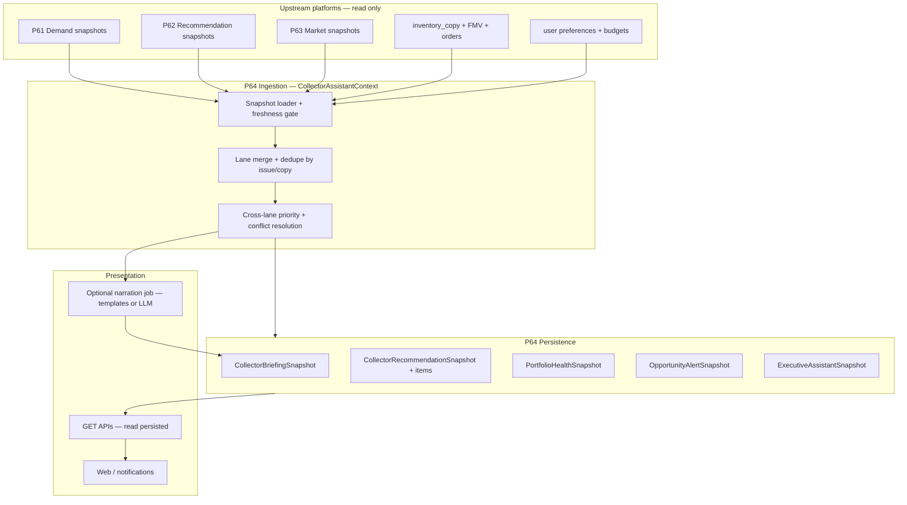

# P64 — AI Collector Assistant (architecture spec)

**Status:** **Phase A (deterministic MVP)** implemented. LLM narration, chat, UI, and weekly automation hooks remain future phases.

**Phase A doc:** [P64_PHASE_A_DETERMINISTIC_MVP.md](P64_PHASE_A_DETERMINISTIC_MVP.md)  
**Certification:** [P64_COLLECTOR_ASSISTANT_CERTIFICATION_REPORT.md](P64_COLLECTOR_ASSISTANT_CERTIFICATION_REPORT.md)

**Purpose:** The final **owner-facing intelligence layer** that reads certified upstream platforms and produces unified, explainable collector guidance: briefings, action lanes (buy / hold / sell / grade / acquire / watch), portfolio health, alerts, and an executive view. P64 **consumes** P61–P63; it does **not** replace their scoring, persistence, or refresh contracts.

**Upstream (committed / implemented):**

| Platform | Doc | Primary artifacts |
|----------|-----|-------------------|
| **P61** Demand Intelligence | [P61_DEMAND_INTELLIGENCE_PLATFORM.md](P61_DEMAND_INTELLIGENCE_PLATFORM.md) | `issue_demand_snapshot`, velocity, spec opportunities, weekly capture |
| **P62** Recommendation Intelligence | [P62_RECOMMENDATION_INTELLIGENCE_PLATFORM.md](P62_RECOMMENDATION_INTELLIGENCE_PLATFORM.md) | V3 preview, buy queue, FOC, pull forecast, auto watchlists |
| **P63** Market Intelligence | [P63_MARKET_INTELLIGENCE_PLATFORM.md](P63_MARKET_INTELLIGENCE_PLATFORM.md) | Portfolio performance, sell signals, acquisition opportunities, market signals |

**Related today (integration targets, not replaced by P64):**

- `daily_action_engine` / `DailyCollectorAction` — operational action drafts
- `executive_dashboard` — cross-domain ops summary
- `agent_platform` (P45) — agent readiness / validation shell
- Legacy hold/sell, grade-before-sell, exit candidates — superseded **for UX** by P64 lanes where P63 rows exist; engines remain until cutover

**Explicit non-goals (P64 spec):**

- Changing P61 refresh formulas, LoCG capture, or entity demand math
- Enabling **Recommendation V3 production persistence** or replacing V2 cross-system writes
- Live marketplace scraping or new pricing ingest
- GET endpoints that rebuild upstream snapshots (P61–P63 POST-only contract preserved)
- Autonomous order placement, listing creation, or grading submission

---

## 1. Product outputs

P64 exposes **ten** primary outputs. Each maps to persisted assistant artifacts plus optional **narration** (LLM or template) for human-readable copy.

| # | Output | Intent | Primary upstream sources |
|---|--------|--------|---------------------------|
| 1 | **Weekly Collector Briefing** | Single narrative summary for the week ahead | P62 FOC + buy queue + watchlists; P61 velocity/spec; P63 signals |
| 2 | **Buy Recommendations** | Actionable preorder / shop list | P62 buy queue, FOC alerts; P61 demand/spec; budget (purchase_budget) |
| 3 | **Hold Recommendations** | Copies and series to retain | P63 sell signals (inverse), P62 pull forecast; inventory hold_status |
| 4 | **Sell Recommendations** | Exit candidates with rationale | P63 sell signals; portfolio tiers; duplicate-copy logic |
| 5 | **Grade Recommendations** | Raw → slab candidates | Grading candidates / grade-before-sell; P63 `GRADE_FIRST` sell actions |
| 6 | **Acquisition Recommendations** | Off-catalog / want-list targets | P63 acquisition; P62 pull forecast; want list / collection gaps |
| 7 | **Watch Recommendations** | Monitor without immediate spend | P62 auto watchlists; P63 `WATCH_*` actions; rising demand signals |
| 8 | **Portfolio Health Summary** | Cost basis, FMV, concentration, trend | P63 portfolio snapshot; FMV history; P61 entity demand (context) |
| 9 | **Opportunity Alerts** | Time-sensitive pushes (FOC, spec spike, sell window) | P62 FOC; P61 spec rows; P63 `SELL_WINDOW` / `SPEC_OPPORTUNITY` signals |
| 10 | **Executive Dashboard** | One-screen status for owner + ops | Freshness of P61–P64 snapshots; cert gates; top actions by lane |

**Design rule:** Rankings and eligibility are **deterministic** from snapshot IDs and versioned `source_version` fields. LLM (if used) may only **summarize and reorder prose**, not change scores or mutate upstream rows.

---

## 2. Data flow



### 2.1 Build pipeline (owner-scoped)

Triggered by **POST** (manual, weekly automation, or ops). Order is fixed:

1. **Freshness gate** — Fail closed or `NOT_READY` if required upstream snapshots are missing or older than policy (see §7).
2. **Load `CollectorAssistantContext`** — Single in-memory bundle: latest P61 issue demand + velocity + spec (for owner issue IDs), P62 buy queue / FOC / forecast / watchlists, P63 portfolio / sell / acquisition / market signals, inventory facts, purchase budget.
3. **Lane builders** — Idempotent pure functions per output (§4); no writes to P61–P63 tables.
4. **Conflict resolution** — Same `release_issue_id` or `inventory_copy_id` may appear in multiple lanes; rules in §4.4.
5. **Persist P64 snapshots** — New generation epoch per build; previous epochs retained for audit.
6. **Optional narration** — Async job writes `briefing_markdown` / `executive_summary` from structured JSON (template first; LLM behind flag).
7. **Certification hook** — Run component checks; attach summary to `ExecutiveAssistantSnapshot.metadata_json`.

### 2.2 Read path

- All owner GETs return **latest** or **by `snapshot_id`** P64 rows only.
- GET **never** calls P61–P63 build endpoints or cross-system refresh.

---

## 3. Models (proposed)

Namespace: `collector_assistant_*` tables. API uses `owner_id`; DB column `owner_user_id`.

### 3.1 Core snapshots

| Model | Purpose |
|-------|---------|
| `CollectorAssistantRun` | Build audit: `owner_user_id`, `started_at`, `finished_at`, `status`, `upstream_fingerprint_json`, `steps_json`, `error_message` |
| `CollectorBriefingSnapshot` | Weekly briefing header: `week_start`, `generated_at`, `briefing_json`, `briefing_markdown`, `source_versions_json` |
| `CollectorRecommendationSnapshot` | One row per **lane** per build: `lane` enum, `total_items`, `metadata_json` |
| `CollectorRecommendationItem` | Unified item shape across lanes (see §3.2) |
| `PortfolioHealthSnapshot` | Aggregated health metrics + `health_score`, `risk_flags_json` |
| `OpportunityAlertSnapshot` | Alert batch: `alert_count`, `critical_count`, `metadata_json` |
| `OpportunityAlertItem` | Single alert with `alert_type`, `severity`, `expires_at`, `action_deep_link` |
| `ExecutiveAssistantSnapshot` | Dashboard bundle: freshness matrix, cert status, top-N per lane, `platform_ready` |

### 3.2 `CollectorRecommendationItem` (unified lane row)

| Field | Notes |
|-------|--------|
| `snapshot_id`, `owner_user_id` | FK |
| `lane` | `BUY`, `HOLD`, `SELL`, `GRADE`, `ACQUIRE`, `WATCH` |
| `priority_score` | 0–100, comparable within lane |
| `confidence` | `HIGH` / `MEDIUM` / `LOW` |
| `title`, `publisher`, `issue_number` | Display |
| `release_issue_id`, `external_catalog_issue_id`, `inventory_copy_id` | Nullable FKs — at least one anchor |
| `recommended_action` | Lane-specific verb (align with P63 sell/acq actions where applicable) |
| `reason_codes` | `string[]` — machine tags (`foc_7d`, `strong_gain`, `rising_velocity`, …) |
| `explanation` | Short deterministic sentence |
| `provenance_json` | `{ "p62_buy_queue_item_id": …, "p63_sell_signal_item_id": … }` |
| `status` | `NEW`, `REVIEWED`, `ACCEPTED`, `DISMISSED`, `COMPLETED` |
| `user_feedback` | Optional `THUMBS_UP` / `THUMBS_DOWN` for future tuning (no online learning in v1) |

### 3.3 Lane enum

`COLLECTOR_LANES = BUY | HOLD | SELL | GRADE | ACQUIRE | WATCH`

Briefing and executive snapshots **reference** lane snapshot IDs rather than duplicating items.

---

## 4. Services (proposed)

| Service | Responsibility |
|---------|----------------|
| `CollectorAssistantContextLoader` | Load P61–P63 latest snapshots + inventory; compute `upstream_fingerprint` hash |
| `CollectorBriefingService` | Build weekly briefing JSON + optional markdown |
| `CollectorBuyLaneService` | Map buy queue + FOC → BUY items; budget caps from `PurchaseBudget` |
| `CollectorHoldLaneService` | HOLD from sell inverse, rising demand, FOC catalysts on owned runs |
| `CollectorSellLaneService` | Map P63 sell signals → SELL lane; merge duplicate legacy sell candidates |
| `CollectorGradeLaneService` | GRADE from sell `GRADE_FIRST` + grading candidates + FMV spread rules |
| `CollectorAcquireLaneService` | Map P63 acquisition + pull forecast gaps |
| `CollectorWatchLaneService` | Map auto watchlists + WATCH actions + non-urgent FOC |
| `PortfolioHealthService` | Derive health score from P63 portfolio + concentration + stale FMV |
| `OpportunityAlertService` | CRITICAL/HIGH alerts from FOC window, spec rank, sell window signals |
| `ExecutiveAssistantService` | Assemble dashboard; call cert aggregator |
| `CollectorAssistantOrchestrator` | `run_collector_assistant_build(owner_user_id)` — pipeline §2.1 |
| `CollectorNarrationService` | Template renderer; optional LLM adapter behind `P64_LLM_NARRATION_ENABLED` |
| `CollectorAssistantCertification` | Component + platform cert (§7) |

### 4.1 Lane source matrix

| Lane | P62 | P63 | Other |
|------|-----|-----|-------|
| BUY | buy_queue_item, foc_alert_item | — | purchase_budget |
| HOLD | pull_forecast (ongoing) | sell_signal (HOLD), market HOLD_STRENGTH | hold_status |
| SELL | — | sell_signal_item | inventory FMV |
| GRADE | — | sell `GRADE_FIRST` | grading_candidate |
| ACQUIRE | pull_forecast | acquisition_opportunity_item | want_list_item |
| WATCH | auto_watchlist_item, foc (low urgency) | acquisition WATCH, market RISING_DEMAND | — |

### 4.2 Weekly briefing structure (`briefing_json`)

```json
{
  "week_start": "2026-06-09",
  "headline": "3 FOC deadlines; 2 sell windows; portfolio +12% unrealized",
  "sections": [
    { "id": "foc", "title": "Preorder this week", "item_refs": ["lane:BUY:…"] },
    { "id": "sell", "title": "Consider selling", "item_refs": ["lane:SELL:…"] },
    { "id": "portfolio", "title": "Portfolio health", "snapshot_id": 123 }
  ],
  "freshness": { "p61": "…", "p62": "…", "p63": "…" }
}
```

### 4.3 Portfolio health score (deterministic v1)

Weighted blend (documented constants, versioned in `source_version`):

- Unrealized gain % band (P63 portfolio header)
- % copies with stale FMV (> N days)
- Concentration in top-5 FMV copies
- Count of `STRONG_GAIN` vs `DOWN` tiers
- Optional: share of inventory with rising vs falling issue demand (when crosswalk exists)

Output: `health_score` 0–100, `health_band` `EXCELLENT` | `GOOD` | `FAIR` | `AT_RISK`.

### 4.4 Cross-lane conflict rules

| Conflict | Resolution |
|----------|------------|
| Same copy in SELL and GRADE | Prefer **GRADE** if `GRADE_FIRST` and raw + FMV spread ≥ threshold; else SELL |
| Same issue in BUY and WATCH | Prefer **BUY** if FOC ≤ 7d or buy queue status `BUY`; else WATCH |
| Same issue in ACQUIRE and BUY (forward) | **BUY** for FOC/preorder; **ACQUIRE** for backfill / want list |
| SELL vs HOLD on same copy | Higher `sell_score` wins; other lane gets dismissed with `superseded_by` in provenance |

---

## 5. APIs (proposed)

**Base prefix:** `/api/v1/collector-assistant`

**Envelope:** `ScanApiV1Envelope` (same as P61–P63). **GET = read persisted only.**

### 5.1 Briefing

| Method | Path | Description |
|--------|------|-------------|
| `GET` | `/briefing/latest` | Latest `CollectorBriefingSnapshot` |
| `GET` | `/briefing/{snapshot_id}` | Historical briefing |
| `POST` | `/briefing/build` | Rebuild briefing (runs full or briefing-only pipeline per flag) |

### 5.2 Recommendations (by lane)

| Method | Path | Description |
|--------|------|-------------|
| `GET` | `/recommendations/{lane}/latest` | `lane` ∈ buy, hold, sell, grade, acquire, watch |
| `GET` | `/recommendations/all/latest` | All lanes in one payload (paginated items) |
| `POST` | `/recommendations/build` | Rebuild all lane snapshots |
| `PATCH` | `/recommendations/item/{id}` | Update `status` / feedback |

### 5.3 Portfolio health

| Method | Path | Description |
|--------|------|-------------|
| `GET` | `/portfolio-health/latest` | Latest health snapshot |
| `POST` | `/portfolio-health/build` | Recompute from P63 + inventory |

### 5.4 Opportunity alerts

| Method | Path | Description |
|--------|------|-------------|
| `GET` | `/alerts/latest` | Active alerts (respect `expires_at`) |
| `POST` | `/alerts/build` | Regenerate alert batch |
| `PATCH` | `/alerts/item/{id}` | Dismiss / acknowledge |

### 5.5 Executive dashboard

| Method | Path | Description |
|--------|------|-------------|
| `GET` | `/executive/latest` | Latest `ExecutiveAssistantSnapshot` |
| `POST` | `/executive/build` | Rebuild executive bundle |

### 5.6 Platform

| Method | Path | Description |
|--------|------|-------------|
| `POST` | `/platform/build` | Full P64 pipeline (§2.1) |
| `GET` | `/platform/certification` | Platform + component cert |
| `GET` | `/platform/freshness` | Upstream snapshot ages without rebuild |

### 5.7 Relationship to existing routes

| Existing | P64 relationship |
|----------|------------------|
| `/executive-dashboard/*` | P64 executive **replaces UX** gradually; legacy route proxies P64 read during migration |
| `/daily-actions/*` | Daily actions remain ops granularity; P64 briefing **links** to daily action IDs in provenance |
| `/agent-platform/*` | Extend readiness checks to include P64 cert + freshness |

---

## 6. Automation

### 6.1 Weekly schedule (recommended)

After certified **P61 post-capture** pipeline (which already runs P62 collector intelligence when `owner_user_id` is set):

| Step | Action |
|------|--------|
| 1 | P63 `POST /market-intelligence/platform/build` (per owner) |
| 2 | P64 `POST /collector-assistant/platform/build` |
| 3 | Optional `CollectorNarrationService` async |
| 4 | Write certification bundle path to `WeeklyDemandCaptureSchedule.details_json` or new `collector_assistant_schedule` row |
| 5 | Emit notifications (existing notification engine) for `OpportunityAlertItem.severity >= HIGH` |

### 6.2 On-demand

- Owner-triggered **“Refresh my assistant”** → P64 platform build only (does not refresh P61–P63 unless explicit advanced ops mode).
- Ops bulk rebuild script: `apps/api/scripts/p64_collector_assistant_certification.py` (mirrors P61/P63 runners).

### 6.3 Idempotency

- Multiple builds same day create new snapshots; **latest** wins for GET.
- `CollectorAssistantRun.upstream_fingerprint_json` skips lane rebuild if fingerprint unchanged (optional optimization v1.1).

---

## 7. Certification

**Report:** `docs/P64_COLLECTOR_ASSISTANT_CERTIFICATION_REPORT.md` (created at implementation time).

### 7.1 Prerequisites (hard gates)

| Prerequisite | Check |
|--------------|-------|
| P61 platform cert | Demand + velocity + spec fresh within policy |
| P62 collector cert | FOC + forecast + watchlists (when flags on) |
| P63 platform cert | Portfolio + sell + signals (owner with inventory for full PASS) |
| Owner isolation | User A cannot read user B snapshots |

### 7.2 P64 component checks

| Component | Verifies |
|-----------|----------|
| **P64-01 Briefing** | Snapshot exists; `briefing_json.sections` non-empty when upstream has items; markdown optional |
| **P64-02 Lanes** | Each enabled lane has snapshot; items sorted by `priority_score`; provenance FKs valid |
| **P64-03 Health** | `health_score` computed; stale FMV flag consistent with inventory |
| **P64-04 Alerts** | FOC-derived alerts present when P62 FOC items exist; severities monotonic |
| **P64-05 Executive** | Freshness matrix matches actual upstream `generated_at` |
| **P64-06 Non-mutation** | P62/P63 row counts unchanged after P64 build (read-only upstream) |

`platform_ready = true` only when all **enabled** components pass and prerequisites are `PASS`.

### 7.3 Empty / sparse owner

| Case | Expected cert |
|------|----------------|
| No inventory | Portfolio health `NOT_READY`; lanes may be sparse; briefing explains setup steps |
| No release issues | BUY/FOC lanes empty; cert may pass with `sparse_owner: true` in notes |
| Upstream stale | `NOT_READY` with `stale_upstream: p62_foc` |

---

## 8. Feature flags

| Flag | Default (dev) | Purpose |
|------|---------------|---------|
| `P64_COLLECTOR_ASSISTANT_ENABLED` | `true` (dev) | Master gate — **on** in Phase A local/dev |
| `P64_BRIEFING_ENABLED` | `true` | Weekly briefing |
| `P64_LANE_BUY_ENABLED` | `true` | Buy lane |
| `P64_LANE_HOLD_ENABLED` | `true` | Hold lane |
| `P64_LANE_SELL_ENABLED` | `true` | Sell lane |
| `P64_LANE_GRADE_ENABLED` | `true` | Grade lane |
| `P64_LANE_ACQUIRE_ENABLED` | `true` | Acquire lane |
| `P64_LANE_WATCH_ENABLED` | `true` | Watch lane |
| `P64_PORTFOLIO_HEALTH_ENABLED` | `true` | Health snapshot |
| `P64_OPPORTUNITY_ALERTS_ENABLED` | `true` | Alerts |
| `P64_EXECUTIVE_DASHBOARD_ENABLED` | `true` | Executive snapshot |
| `P64_LLM_NARRATION_ENABLED` | `false` | LLM prose (template-only when off) |
| `P64_WEEKLY_AUTOMATION_ENABLED` | `false` | Hook into post-capture pipeline |

**Unchanged from upstream:** `P62_V3_PERSIST_ENABLED` remains **false** unless a future phase explicitly enables it.

---

## 9. Rollout plan

### Phase A — Deterministic core (MVP)

- Models + migration + `CollectorAssistantOrchestrator`
- Lanes BUY, SELL, ACQUIRE, WATCH from P62/P63 mapping only
- GET/POST APIs + certification script (no LLM)
- Internal dogfood behind `P64_COLLECTOR_ASSISTANT_ENABLED`

### Phase B — Briefing + health + alerts

- Weekly briefing templates
- Portfolio health score
- Opportunity alerts + notification hooks
- Weekly automation behind `P64_WEEKLY_AUTOMATION_ENABLED`

### Phase C — HOLD + GRADE + executive

- Hold/grade lane merge rules (§4.4)
- Executive dashboard; deprecate duplicate legacy dashboard panels progressively

### Phase D — Narration + feedback (optional)

- `P64_LLM_NARRATION_ENABLED` for briefing markdown only
- User feedback capture on items (storage only; no weight changes)

### Phase E — UI cutover

- Web: single **Collector Assistant** home with ten outputs
- Feature parity checklist vs legacy sell/hold/acquisition dashboards
- Remove redundant GET rebuild paths from legacy surfaces (P61-00 alignment)

---

## 10. Testing strategy (implementation phase)

| Suite | Covers |
|-------|--------|
| `test_p64_collector_briefing.py` | Briefing sections, empty upstream |
| `test_p64_recommendation_lanes.py` | Per-lane build, ordering, provenance |
| `test_p64_portfolio_health.py` | Health score bands |
| `test_p64_opportunity_alerts.py` | FOC + sell window alerts |
| `test_p64_executive_dashboard.py` | Freshness matrix |
| `test_p64_platform.py` | Full build, cert bundle, P62/P63 non-mutation |
| `test_p64_owner_isolation.py` | Cross-owner read denied |

Contract tests: every POST build returns new `snapshot_id`; GET never increments upstream table counts.

---

## 11. Security and privacy

- All routes owner-authenticated; ops bulk scripts require ops admin
- `provenance_json` must not leak other owners’ IDs
- LLM narration sends only **structured lane JSON**, not raw PII beyond collector profile fields already in app
- Audit: `CollectorAssistantRun` retained 90 days minimum for cert replay

---

## 12. Open decisions (resolve before implementation)

1. **Single vs per-lane snapshot tables** — Spec assumes one `CollectorRecommendationSnapshot` per lane per build; alternative is one mega-snapshot with lane partition key.
2. **Briefing week boundary** — Calendar Monday vs FOC-week (Wednesday-aligned) — recommend **Wednesday** to match demand capture schedule.
3. **Executive vs existing `executive_dashboard` service** — Merge into P64 service with adapter, or thin proxy layer.
4. **LLM provider** — Template-only MVP; if LLM, use existing agent infrastructure and redact logs.

---

## 13. Summary

P64 is the **read-mostly consolidation and narration layer** atop P61–P63. It turns certified demand, recommendation, and market snapshots into ten owner-visible outputs with explicit POST rebuild, snapshot auditability, and certification that proves upstream isolation and freshness. Implementation should follow the same patterns as P62/P63: SQLModel tables, `ScanApiV1Envelope` APIs, feature flags, pytest certification, and weekly automation chained after P61 post-capture.
