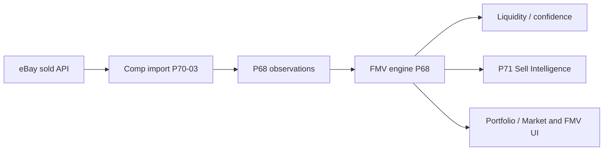

# P70 Market Intelligence Platform — Closeout Audit

## Phase summary

| Phase | Status | Deliverable |
|-------|--------|-------------|
| P70-01 | COMPLETE | eBay OAuth connectivity, provider health |
| P70-02 | COMPLETE | eBay sold search preview API |
| P70-03 | COMPLETE | eBay comp import + persistence |
| P70-04 | COMPLETE | P68 FMV engine integration (gated eBay provider) |
| P70-05 | COMPLETE | P71 sell intelligence market inputs |
| P70-06 | COMPLETE | FMV adoption, refresh automation, trend foundation |

## Architecture

## Provider flow

eBay → Comp Import → FMV Engine → Liquidity → Sell Intelligence

Scheduled refresh (`market_refresh_service.py`) rebuilds P68 snapshots for priority holdings (top FMV, exit queue, buy-queue matches) **nightly** via RQ (`scheduled-market-refresh-scan`). Manual: `POST /api/v1/market-pricing/refresh/run`.

## P70-06 additions

- `authoritative_fmv_service.py` — single read path for blended FMV + provider breakdown
- `p70_market_refresh_run` / `p70_market_fmv_trend_point` — refresh + trend history
- Provider health metadata: `last_refresh_at`, `last_fmv_generation_at`, `last_import_at`
- Docs: `P70_FMV_ADOPTION_AUDIT.md`

## Known limitations

- `EbayCompRecord` import path is not yet merged into P68 observation ingest (snapshots use live/search/fixture ingest).
- Full-library nightly refresh is scoped to target copy sets, not every copy every night.
- Legacy `MarketFmvSnapshot` remains for historical comps; P68 wins for display when present.
- Recommendation SQL aggregates may still reference `InventoryCopy.current_fmv` until refactored.

## Future integration points

- Wire `EbayCompRecord` → `P68MarketPriceObservation` ingest
- Provider-weighted blending in `compute_fmv_bundle` (weights placeholder today)
- UI: expose `provider_breakdown` and trend points on Market & FMV pages
- Optional read-model sync job (still without auto-overwriting inventory)

## Production considerations

- Set `EBAY_API_CLIENT_*`, `P68_EBAY_PROVIDER_ENABLED` as needed
- Keep `P68_AUTO_OVERWRITE_INVENTORY_FMV=false` unless ops explicitly enables writes
- Ensure RQ worker runs `run_scheduled_market_refresh_scan` (chained from lunar daily scan scheduler)
- Run `alembic upgrade head` for `20260606_0233`

## Approval

**P70 Market Intelligence Platform — APPROVED_FOR_PRODUCTION** (pending your deploy verification).
