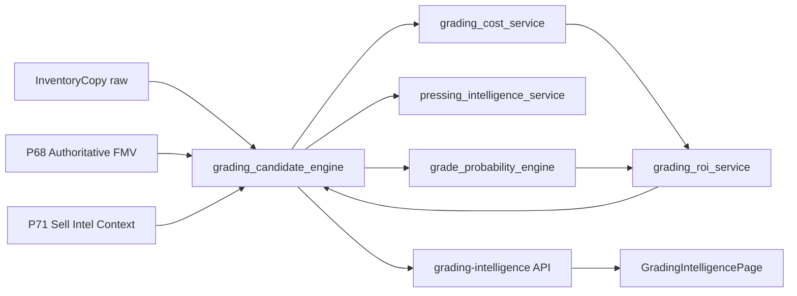

# P72-01 Grading Decision Engine

## Objective

Read-only advisory layer that answers **should I grade this book?** using P68 market pricing, P70 eBay market intelligence (via snapshots), P71 sell intelligence context, and inventory portfolio metadata.

This phase does **not** estimate grades from images, submit to CGC, generate shipping labels, manage grading queues, or mutate inventory.

## Architecture



| Module | Role |
|--------|------|
| `grading_candidate_engine.py` | Discovery, `grading_score` (0–100), recommendation enum |
| `grade_probability_engine.py` | Metadata-based 9.8 / 9.6 / 9.4 / 9.2 / other probabilities |
| `pressing_intelligence_service.py` | `PRESS` vs `DO_NOT_PRESS` |
| `grading_cost_service.py` | CGC modern/vintage, press, clean, ship, insurance |
| `grading_roi_service.py` | Expected graded FMV, profit, ROI breakdown |
| `p72_grading_decision_dashboard.py` | Dashboard + API DTO mapping |

**Note:** `grading_candidate_service.py` remains the P37 **operational** candidate registry; P72 discovery lives in `grading_candidate_engine.py`.

## Inputs

Per raw `InventoryCopy`:

- `raw_fmv` / `blended_fmv` from `get_authoritative_fmv` (P68 snapshot preferred)
- Optional `graded_fmv` anchor from latest P68 snapshot
- Liquidity, confidence, sales velocity from P68
- P71 sell intelligence context (timing, FMV confidence)
- Metadata: publisher, `release_year`, `condition_notes`, ownership source

## Scoring

**`grading_score` (0–100)** combines:

- Expected ROI tiers (+8 to +40)
- Liquidity (up to +25)
- Market confidence (up to +15)
- Sell intelligence (up to +10)
- Penalties for low profit, low raw FMV, negative ROI

**Recommendations:**

| Score / ROI | Output |
|-------------|--------|
| High score, ROI ≥ 50%, profit ≥ $15 | `PRESS_AND_GRADE` if press advised else `GRADE` |
| Moderate ROI | `GRADE` or `WATCH` |
| Low | `DO_NOT_GRADE` |

## ROI formulas

- **Expected graded FMV:** Σ (grade_probability × FMV_at_grade)
- **FMV_at_grade:** Uses P68 `graded_fmv` anchor when present; else raw/blended × grade multipliers
- **Total cost:** grading + optional press/clean + shipping + insurance
- **Expected profit:** `expected_graded_fmv - raw_fmv - total_cost`
- **Expected ROI %:** `expected_profit / total_cost × 100`

## APIs

- `GET /api/v1/grading-intelligence/candidates`
- `GET /api/v1/grading-intelligence/dashboard` (includes `decision_engine`)
- `GET /api/v1/grading-intelligence/{inventory_copy_id}` (numeric ID only; registered last)

## Example (illustrative)

**Absolute Batman #1** — Raw FMV $22, graded market anchor $95, modern DC:

- Grade probabilities from NM-style notes (e.g. 9.6 modal)
- Press when defects or strong modern ROI economics
- Expected graded FMV ~$90+ with anchor; ROI driven by configurable CGC cost stack

## Known limitations

- No cover/image grading signal
- Grade multipliers are heuristic when graded comps are missing
- Does not write candidates to P37 submission pipeline
- Per-copy route must not use non-numeric path segments (FastAPI int constraint)

## Verification

```bash
pytest tests/test_grading_candidate_engine.py -v
pytest tests/test_grade_probability_engine.py -v
pytest tests/test_pressing_intelligence.py -v
pytest tests/test_grading_roi.py -v
pytest tests/test_grading_dashboard.py -v
python -c "from app.main import app; print('app import ok')"
cd apps/web && npm run build
```
