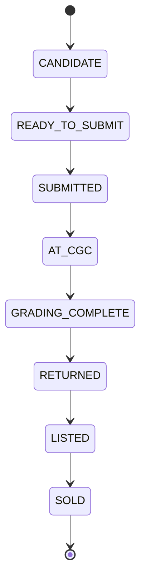

# P72-02 Grading Operations Platform

## Objective

Operational workflow for grading submissions. P72-01 answers *should I grade?*; P72-02 answers *what happens next?*

No direct CGC API submission, no shipping label generation, no image grading, and no automatic changes to P72-01 recommendations.

## Workflow



## Status definitions

| Status | Meaning |
|--------|---------|
| `CANDIDATE` | Enqueued from inventory; not yet batched |
| `READY_TO_SUBMIT` | Assigned to a batch; ready to ship |
| `SUBMITTED` | Owner marked as sent to grader |
| `AT_CGC` | Received / in grader pipeline |
| `GRADING_COMPLETE` | Grading finished; awaiting return ship |
| `RETURNED` | Slab in hand; grade, cert, and cost captured |
| `LISTED` | Listed for sale post-grade |
| `SOLD` | Exit complete |

## Components

| Module | Role |
|--------|------|
| `grading_queue_service.py` | Enqueue, list, filter, status transitions |
| `grading_submission_batch.py` | Batch CRUD, assign / bulk move |
| `grading_audit_log.py` | Append-only lifecycle audit |
| `p72_grading_operations_dashboard.py` | Metrics and summaries |

## Data model

- `p72_grading_batch` — name, dates, costs, CGC tracking fields
- `p72_grading_queue_entry` — per-book status and return fields
- `p72_grading_audit_log` — every status / batch event
- `p72_inventory_grading_history` — immutable return record per inventory copy

## APIs (under `/api/v1/grading-intelligence`)

- `GET /queue` — status, batch, search filters
- `POST /queue/enqueue` — bulk enqueue by `inventory_copy_ids`
- `POST /queue/{id}/status` — validated transitions + return payload
- `GET /batches` / `POST /batches`
- `POST /batches/{id}/assign` — single or bulk assignment / move
- `GET /dashboard` — includes `operations_engine` metrics

## Operational procedure (example)

1. Enqueue raw copies (`POST /queue/enqueue`).
2. Create **CGC June 2026 Batch** with `queue_entry_ids`.
3. Move status to `READY_TO_SUBMIT` → `SUBMITTED` (manual ship).
4. Update to `AT_CGC` → `GRADING_COMPLETE` using received / ETA dates on batch or entry.
5. On return: `RETURNED` with `actual_grade`, `certification_number`, `final_grading_cost` — writes inventory grading history and updates `grade_status` on the copy.
6. `LISTED` → `SOLD` as the book moves through sales.

## Metrics

Dashboard `operations_engine.metrics` tracks waiting/submitted/at CGC/returned/listed/sold counts, books in process, average turnaround, average grading cost, and total spend.

## Verification

```bash
pytest tests/test_grading_queue.py -v
pytest tests/test_grading_batches.py -v
pytest tests/test_grading_status_workflow.py -v
pytest tests/test_grading_dashboard.py -v
python -c "from app.main import app; print('app import ok')"
cd apps/web && npm run build
```
