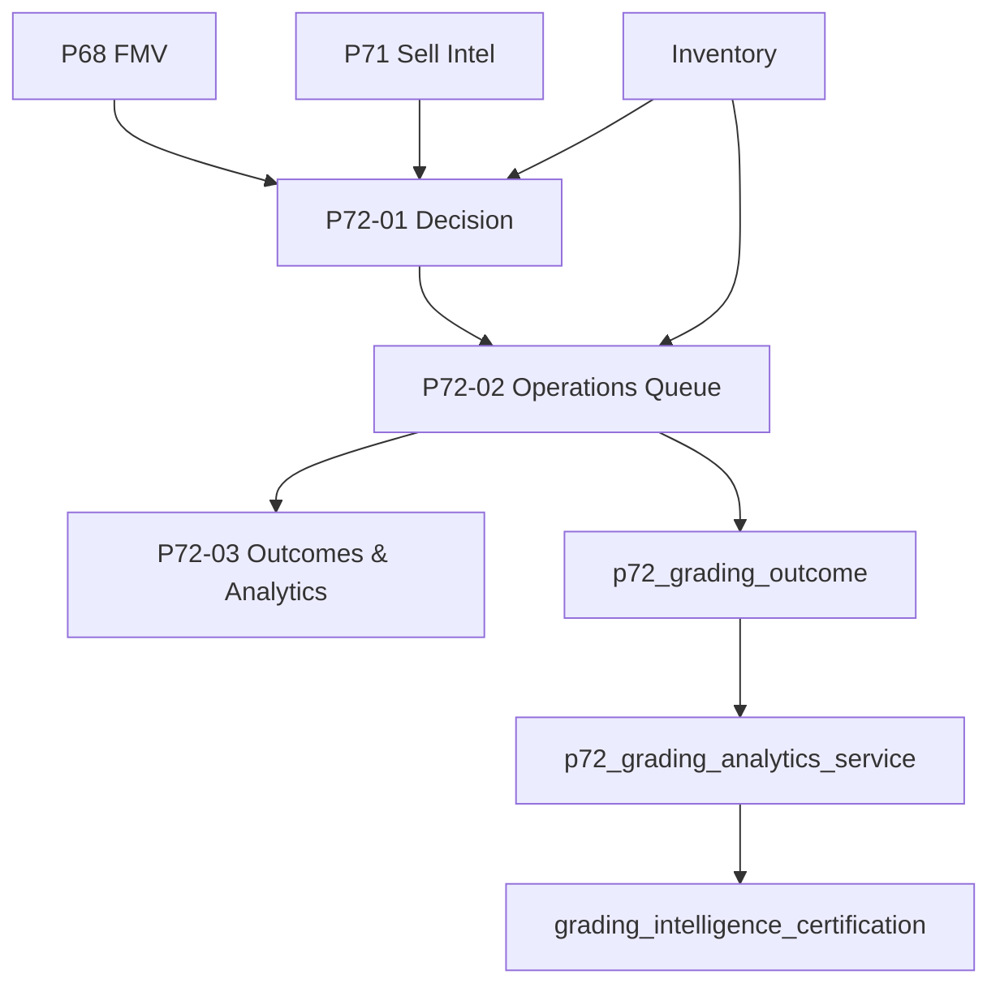

# P72 Grading Intelligence Platform — Production Review

## Platform scope

| Phase | Question | Status |
|-------|----------|--------|
| P72-01 | Should I grade? | Decision engine, probabilities, pressing, ROI (advisory) |
| P72-02 | What happens next? | Queue, batches, CGC tracking fields, lifecycle audit |
| P72-03 | Was grading worth it? | Outcomes, analytics, certification |

**Production status:** `APPROVED_FOR_PRODUCTION` when `GET /api/v1/grading-intelligence/certification` reports `approved_for_production: true`.

## Architecture



## Data flow

1. Raw copies evaluated by `grading_candidate_engine` (read-only).
2. Operator enqueues copies → batch → manual status transitions.
3. On `RETURNED`, `grading_outcome_service` records expected vs actual ROI/grade.
4. Analytics aggregate outcomes for performance, ROI rollups, pressing, portfolio impact.
5. Certification runs deterministic checks across discovery, math, queue rules, dashboards.

## ROI calculations

- **Expected (P72-01):** Σ(probability × grade FMV) − raw − costs.
- **Actual (P72-03):** grade-multiplier FMV at `actual_grade` − raw − `final_grading_cost`.
- **Accuracy:** HIGH if |expected − actual ROI| ≤ 15% and actual ROI ≥ 0.

## Operational workflow

Statuses: `CANDIDATE` → `READY_TO_SUBMIT` → `SUBMITTED` → `AT_CGC` → `GRADING_COMPLETE` → `RETURNED` → `LISTED` → `SOLD`. No CGC API or label generation.

## Analytics accuracy

- Outcomes materialized at return; backfill via `sync_outcomes_from_queue`.
- Grade distribution and hit rates derived from `actual_grade` on outcomes.
- Publisher/series/era rollups use queue/outcome metadata (character/creator optional in `metadata_json`).

## Known limitations

- Graded FMV at outcome uses multiplier heuristics, not live slab comps.
- P49 `GET /grading-intelligence/roi` remains agent ROI analyses; P72 measured ROI is `GET /grading-intelligence/roi-analytics`.
- No image-based grade estimation anywhere in P72.
- Recommendation accuracy compares outcomes to decision engine at record time (may drift if FMV moves).

## Future enhancements

- Wire sale proceeds into actual ROI for `SOLD` status.
- Persist decision snapshot at enqueue to freeze expected ROI.
- Slab FMV from P68 graded comps per cert number.

## Verification

```bash
pytest tests/test_grading_analytics.py tests/test_grading_outcomes.py \
  tests/test_grading_roi_accuracy.py tests/test_grading_recommendation_accuracy.py \
  tests/test_p72_production_review.py -v
python -c "from app.main import app; print('app import ok')"
cd apps/web && npm run build
```
