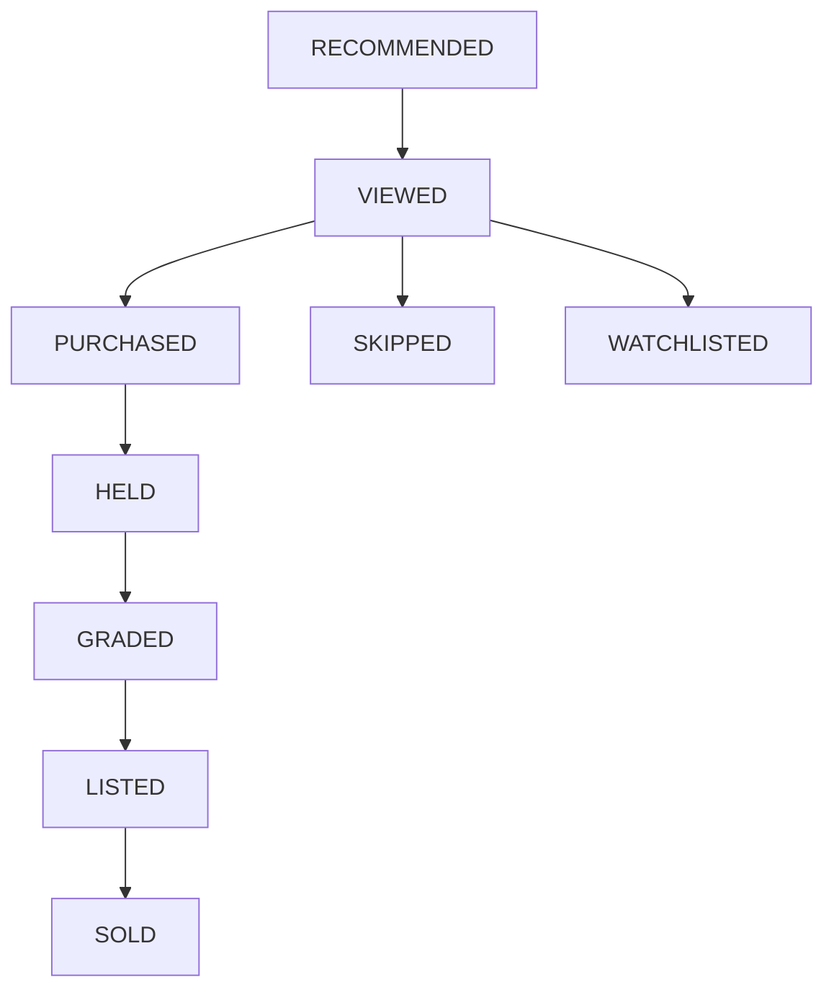

# P73-01 Recommendation Outcome Tracking

## Objective

Track what happens after ComicOS makes a recommendation. This phase does **not** adjust scores, rankings, models, or recommendation logic.

## Lifecycle



Status on an outcome is the highest-stage event recorded (not necessarily strict linear order).

## Event definitions

| Event | Meaning |
|-------|---------|
| `RECOMMENDED` | Outcome row created (system) |
| `VIEWED` | User viewed the recommendation |
| `PURCHASED` | Purchase confirmed |
| `SKIPPED` | User skipped |
| `WATCHLISTED` | Added to watchlist |
| `HELD` | Held in inventory |
| `GRADED` | Entered grading workflow |
| `LISTED` | Listed for sale |
| `SOLD` | Sale completed |

## Attribution rules

| Recommendation type | Expected outcome event |
|--------------------|-------------------------|
| `BUY` / `BUY_AGGRESSIVE` | `PURCHASED` |
| `GRADE` / `GRADE_CANDIDATE` | `GRADED` |
| `SELL` / `SELL_NOW` / `FLIP` | `SOLD` |

`attribution_accurate` is set when the derived status matches the expected mapping; otherwise `null` if no mapping exists.

## Automatic sources (explicit only)

- **Grading queue enqueue** → `GRADED` for linked `inventory_copy_id` outcomes
- **Grading queue status** `LISTED` / `SOLD` → matching events

No retroactive inference for purchases or sales without a linked outcome.

## APIs

- `GET /api/v1/recommendation-feedback/outcomes`
- `POST /api/v1/recommendation-feedback/outcomes`
- `GET /api/v1/recommendation-feedback/outcomes/{id}`
- `POST /api/v1/recommendation-feedback/outcomes/{id}/event`
- `GET /api/v1/recommendation-feedback/summary`

## Known limitations

- Outcomes must be created explicitly (or by a future recommender integration); workflows only append events when `inventory_copy_id` is linked.
- Multiple outcomes per copy may each receive automatic events (capped to 3 recent links).

## Verification

```bash
pytest tests/test_recommendation_outcomes.py -v -k p73
pytest tests/test_recommendation_events.py -v
pytest tests/test_recommendation_timeline.py -v
pytest tests/test_recommendation_summary.py -v
python -c "from app.main import app; print('app import ok')"
cd apps/web && npm run build
```
