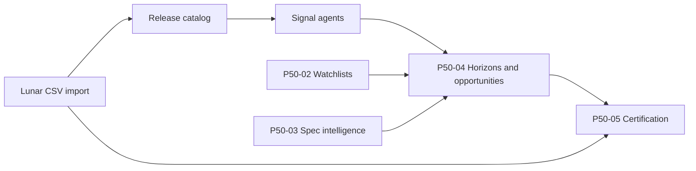

# Release Platform Architecture (P50)

The P50 Release Intelligence Platform covers Lunar-fed release catalogs, watchlists and continuity, spec intelligence, opportunity horizons, scheduled imports, and variant intelligence. P50-05 adds read-only validation, health, summary, and production certification without changing scoring or import behavior.

## P50-01 — Release Intelligence

- **Purpose:** Owner-scoped release series, issues, key signals, and agent-driven detection (new #1s, milestones, variants).
- **Key models:** `release_series`, `release_issue`, `release_variant`, `release_key_signal`.
- **API prefix:** `/api/v1/release-intelligence`
- **Constraints:** Signals are append-only; agents do not mutate inventory.

## P50-02 — Watchlists & Continuity

- **Purpose:** Manual watchlists, collection runs, continuity alerts, and continue-run planning.
- **Key models:** `release_watchlist`, `release_watchlist_item`, `collection_run`, `collection_continuity_alert`.
- **API prefix:** `/api/v1/release-watchlists`
- **Constraints:** Advisory planning only.

## P50-03 — Spec Intelligence

- **Purpose:** Spec scoring and buy/pass recommendations on release issues.
- **Key models:** `spec_score`, `spec_recommendation`, `spec_recommendation_review`.
- **API prefix:** `/api/v1/spec-intelligence`
- **Constraints:** No automatic purchasing; reviews are append-only.

## P50-04 — Release Platform (Horizons & Opportunities)

- **Purpose:** Horizon buckets, ranked opportunities, future buy queue, run planning, budget, and ratio/new variant dashboards.
- **Services:** `release_horizon_engine`, `opportunity_intelligence`, `continue_run_planning`, `release_opportunity_dashboard`
- **API prefix:** `/api/v1/release-platform` (operational dashboards)
- **UI:** `/release-platform`

## P50-04A–04D — Lunar Feed, Scheduler, Variants, Idempotency

- **Lunar connector:** Remote CSV fetch, normalization, canonical issue UUIDs, variant rows.
- **Scheduler:** Owner-scoped `lunar_schedule_config` and `lunar_scheduled_run`.
- **Variant intelligence:** Grouped issues with `release_variant` children; repair and re-import idempotency via canonical resolution.
- **API prefixes:** `/api/v1/lunar-feed`, `/api/v1/lunar-scheduler`, `/api/v1/release-imports`

## P50-05 — Release Platform Closeout & Certification

- **Purpose:** PASS/WARNING/FAIL validation, HEALTHY/WARNING/FAILED/DISABLED health, aggregate summary, and `APPROVED_FOR_PRODUCTION` certification.
- **Services:** `release_platform_validation`, `release_platform_health`, `release_platform_summary`, `release_platform_certification`
- **API prefix:** `/api/v1/release-platform/{validation,health,summary,certification}`
- **UI:** `/release-platform-certification`
- **Constraints:** Read-only closeout; no scoring, Lunar import, scheduler, or variant logic changes.

## Data flow (high level)

## Integration boundaries

- **P47/P48:** Forecast and production readiness are independent lanes.
- **P46:** Marketplace inventory and listings are not modified by release platform closeout.
- **Inventory/orders:** Release intelligence reads collection runs but does not allocate or sell stock.
